# UX Design Specification - fledgely

**Author:** Cns
**Date:** 2025-12-09

---

<!-- UX design content will be appended sequentially through collaborative workflow steps -->

## Executive Summary

### Project Vision

Fledgely reimagines parental controls through a **"supervision through consent, not control"** philosophy. Where competitors impose restrictions (earning 76% 1-star ratings from children), fledgely creates collaborative family digital agreements where children actively participate in defining their own protection.

**Core Promise:** Safe freedom, not a cage - providing parents peace of mind while respecting children's growing autonomy.

**The Fundamental Insight:** Parental control apps fail because they're built for scared, incompetent-feeling parents who use control as a substitute for understanding. Fledgely must help parents feel COMPETENT, not just in control.

---

### Target Users

**Primary Users:**

| User Type | Description | Key Needs |
|-----------|-------------|-----------|
| **Parents** | Seeking visibility and safety without damaging trust. Range from tech-savvy to minimal technical skills. | Competence, peace of mind, easy setup, trust-building tools |
| **Children (6-17)** | Digital natives who expect transparency and respect. Must feel protected, not policed. | Respect, agency, fair treatment, visible progress toward autonomy |
| **Delegated Guardians** | Grandparents, babysitters needing temporary, bounded access. | Ultra-simple "green/yellow/red" status view |
| **Shared Custody Families** | Co-parents requiring coordination without conflict ammunition. | Symmetry, cooling periods, no weaponization |

**User Sophistication Spectrum:**
- Parents: Range from tech-savvy to minimal technical skills
- Children: Digital natives, often more tech-savvy than parents
- Both: Expect consumer-grade polish (not enterprise complexity)

---

### Key Design Challenges

1. **Dual-Audience Design:** Every interface must work for both parents AND children with appropriate emotional framing

2. **Agreement Complexity vs Usability:** Support up to 100 conditions while remaining understandable at 6th-grade reading level

3. **Multi-Platform Consistency:** Unified experience across 7+ platforms with different interaction paradigms (keyboard, remote, touch, system tray)

4. **Emotional Safety Design:** Crisis moments require zero-friction, calming UX that never punishes

5. **Self-Hosted Confidence:** Non-technical users need clear status and cost visibility

6. **Authentic Co-Creation vs Forced Agreement:** Must design negotiation flow for when family disagrees. "Agreement" must have real meaning.

7. **Age-Adaptive Interfaces:** 7-year-old participation ≠ 14-year-old participation. Tiered complexity without patronizing.

8. **AI Classification Anxiety:** Children fear being falsely flagged. Need explanation and dispute mechanisms.

9. **Abuse-Resistant Design:** UX must protect children in dysfunctional families, not just serve functional ones.

---

### Design Opportunities

1. **Trust-Building Pattern Innovation:** Create "Fledge Compact" - visual agreements that both parties sign as family ceremony

2. **Child-Centric Dashboard:** Give children their own view showing agreements, progress, earned freedoms, and their screenshot history

3. **Emotional State Awareness:** Adapt UX tone based on AI-detected activity context (homework mode, crisis, leisure)

4. **Onboarding as Family Ceremony:** Transform technical setup into relationship-building moment

5. **Conflict-Free Shared Custody:** Design custody coordination as first-class feature with symmetry enforcement

6. **Delegated Guardian "Dashboard Lite":** Ultra-simplified view for grandparents - green/yellow/red status only

7. **Dispute & Explanation System:** Let children challenge AI classifications and see reasoning

8. **Digital Citizenship Education:** Context that social media tracks FAR more aggressively with dark patterns - this is a safety tool, temporary, transparent, on YOUR side

9. **Graduation Ceremony:** Explicit UX for "you've outgrown this" transition, celebrating independence

---

### Core Design Principles

| # | Principle | Rationale |
|---|-----------|-----------|
| 1 | **"When parent convenience conflicts with child dignity, choose dignity"** | Parents want children to WANT to use this. Long-term family trust > short-term parental control. |
| 2 | **"Design for the family, not either party alone"** | When interests conflict, ask: "What serves the RELATIONSHIP?" |
| 3 | **"Monitoring data is family connection fuel, not just safety evidence"** | Every piece of data should have a path to becoming a positive family moment. |
| 4 | **"Borrow UX patterns from domains where people WANT to be tracked"** | Fitness, gaming, meditation - make fledgely feel like closing activity rings, not having a parole officer. |
| 5 | **"Help parents feel competent, not just in control"** | Educate parents about digital life, not just show them data. |
| 6 | **"Design for the worst user, not the best"** | Assume data will be misused. Build guardrails that don't rely on good judgment. |
| 7 | **"The app's job is to make itself unnecessary"** | Success = graduation. Retention is a failure mode, not a goal. |
| 8 | **"Honest framing"** | Call it "agreement" not "consent." Acknowledge parent authority while valuing child voice. |

---

### Strategic UX Principles

**Asymmetric Notification:**
- Children: Notify only when action needed by them
- Parents: Notify only when intervention warranted
- Default state: Silence means everything is fine

**Conflict as Feature:**
- Design the dispute flow as carefully as the happy path
- Track disputes and resolutions as trust-building moments
- Celebrate compromises reached

**Crisis Sovereignty:**
- Child's immediate safety > Parent's awareness
- Professional resources first; system NEVER auto-notifies parents
- Child encouraged to talk to parent, but choice is theirs

**Visible Progress:**
- Trust scores must feel achievable, not arbitrary
- Show "next milestone" always
- Celebrate autonomy earned, publicly

**Ceremony at Thresholds:**
- First agreement: Family ritual
- Trust level increases: Recognition moment
- New freedoms: Explicit acknowledgment

---

### UX Requirements from Pre-Mortem Analysis

**Preventing Complexity Cliff:**
- 5-minute first agreement via templates ("Simple Safety," "Balanced," "Custom")
- 2-minute device enrollment via QR code
- Progressive dashboard - advanced features hidden until needed
- "Just works" sensible defaults

**Preventing Trust Score Backlash:**
- Meaningful trust milestones: 80% = reduced screenshots, 95% = notification-only mode
- Visible graduation path: "At 100% for 6 months, parents can remove monitoring"
- Transparent scoring with specific positive behavior callouts
- Real autonomy earned, not just a number

**Preventing Screenshot Scandal:**
- No bulk export - viewable in-app only
- 7-day max retention with visible countdown
- View watermarking with timestamp in family audit
- Both parents required for any external sharing

**Preventing False Positive Firestorm:**
- High confidence threshold (90%+) before flagging
- Context awareness (school hours, edu domains = higher threshold)
- 30-minute grace period for child annotation before parent sees flag
- Instant dispute mechanism

**Preventing Shared Custody Catastrophe:**
- Symmetry enforcement - both parents see exactly same data
- 48-hour cooling period for rule changes
- ToS: data cannot be used in legal proceedings
- Conflict detection prompts mediation

**Preventing Graduation Gap:**
- Age-based prompts at 16, 17
- 6-month sunset reminders before 18th birthday
- Explicit "Complete Fledgely Journey" graduation ceremony
- Track "graduated families" as success metric

---

### Innovative Feature Concepts

**From Improv Session:**

| Feature | Description | Impact |
|---------|-------------|--------|
| **Proud Moments Feed** | AI captures positive highlights; child curates what parents see | Flips surveillance to self-presentation |
| **Family Achievements** | Collective goals the whole family works toward | Unifies family vs goal, not parent vs child |
| **Family Rewards** | Achievement unlocks family-decided real rewards | App becomes tool for family promises |
| **Trust Journey Time Capsule** | Monthly summaries; graduation gift showing growth | Reframes monitoring as growth narrative |
| **Parent Badges** | Parents earn recognition for trusting, letting go | Gamifies healthy parenting behaviors |
| **Conversation Starters** | Data-informed dinner table prompts | Turns monitoring into connection |
| **"Look at This!" Button** | Child proactively shares moments with parents | Rewards initiative; positive interruptions |
| **Family Quests** | Optional cooperative challenges for whole family | Transforms app into cooperative game |
| **Graduation Quest** | Multi-month journey toward independence together | Makes ending a shared achievement |

**From Genre Mashup:**

| Feature | Source Domain | Description |
|---------|---------------|-------------|
| **Digital Relationship Check-ins** | Couples Therapy | Weekly 2-min reflection for both parent and child |
| **Activity Rings** | Fitness Trackers | Visual balance across Creative/Educational/Entertainment/Social |
| **Trust Skill Tree** | Video Games | Visual progression showing unlocks, next goals, path to freedom |
| **Mindful Transitions** | Meditation Apps | Gentle wind-down at limits, not hard cutoff |
| **Rule Proposals** | Open Source | Child drafts changes; parents review; democratic process |

---

### Agreement & Override Mechanics

**Screenshots:** Captured per agreed schedule (consent already given via Fledge Compact). Frequency defined in agreement.

**Crisis Handling:** System NEVER notifies parents automatically. Child shown resources and encouraged to talk to parent, but system doesn't inform. Child sovereignty in crisis moments.

**Agreement Changes:** Parent modifies agreement → Child sees proposed changes → Child accepts (or negotiates) → Changes take effect. No retroactive enforcement without prior agreement terms.

**Two-Tier Rules:**
- **Safety Rules:** Parent authority, child input welcomed but not required for enforcement
- **Lifestyle Rules:** Negotiable, child voice matters, changes require acceptance

---

### Root Cause Insights

| Surface Problem | Root Cause | UX Response |
|-----------------|------------|-------------|
| Children hate control apps | Parents use control as substitute for competence | Help parents feel competent through education |
| "Consent" feels fake | Value is in participation, not permission | Rename to "co-creation"; design meaningful process |
| Screenshots feel invasive | Parents conflate seeing with safety | AI provides safety; human review only when flagged |
| Shared custody weaponization | High-conflict overrides judgment | Build protective friction; design for worst users |
| No graduation | Parents lack "ready" model | App pushes toward independence; shows readiness |

---

## Core User Experience

### The Defining Experience: Living With the Agreement

The fundamental user experience of fledgely is not monitoring, not restriction, not even safety - it is **living with the agreement**. Both parents and children exist within a shared digital contract that:

- **Binds both parties**: Agreements contain commitments from parents AND children
- **Mixes enforcement types**: Some terms are system-enforced (screen time limits, content filtering), others are out-of-band promises (real-world rewards, device privileges, parental behaviors)
- **Evolves organically**: The first agreement is a starting point, not a destination - it matures through continuous parent/child tuning
- **Individualizes per child**: Each child has their own agreement reflecting their age, maturity, and demonstrated responsibility

**The Agreement is the Product.** Everything else - screenshots, time tracking, content filtering - are enforcement mechanisms for terms both parties agreed to.

---

### Critical Success Moment: Agreement Co-Creation

The single most important UX moment is **agreement construction/creation between multiple parties**. This is where fledgely succeeds or fails:

**What Must Be True:**
1. Both parent and child feel genuinely heard during creation
2. The resulting document reflects real negotiation, not rubber-stamping
3. Children understand what they're agreeing to at their reading level
4. Parents understand what they're committing to as well
5. The agreement feels like a family moment, not a legal contract

**Design Requirements:**
- **Multi-party workflow**: Support 2 parents + 1 child, 1 parent + multiple children, shared custody configurations
- **Async capability**: Not everyone can sit together; support propose-review-accept flow
- **Age-adaptive presentation**: Same agreement, different views (visual for young, detailed for older)
- **Ceremony integration**: Culminates in the "Fledge Compact" signing moment
- **Template foundation**: Start from templates, customize from there

**Why This Is Hard:**
- Family disagreements are inevitable - must design the conflict path
- Power dynamics are inherent - child can't truly negotiate as equal
- Time pressure is real - parents want "quick setup"
- Technical complexity lurks - 100 possible conditions

**Success Metrics:**
- Time to first agreement: Target 15-30 minutes (not 5-minute compromise)
- Agreement modification rate: Healthy families iterate; stagnant agreements suggest disengagement
- Child acceptance rate: If children routinely reject, system is failing
- Agreement balance score: System measures commitments on both sides

---

### Platform Strategy

**Primary Platform: Web Dashboard**
- Full agreement creation and management
- Complete monitoring review
- Family administration
- Self-hosting configuration

**Agent Platforms (Monitoring/Enforcement):**

| Platform | Interaction Paradigm | Primary Functions |
|----------|---------------------|-------------------|
| **Chromebook** | Keyboard/trackpad | Extension: screenshot capture, content filtering, time tracking |
| **Android** | Touch | App: screenshot capture, app monitoring, location (optional) |
| **Fire TV** | Remote (D-pad) | App: viewing time, content ratings, bedtime enforcement |
| **Nintendo Switch** | Controller | Parental controls integration, playtime limits |
| **Xbox** | Controller | Family settings integration, game ratings, screen time |
| **iOS** | Touch | App: Screen Time API integration, content filtering |
| **Windows/macOS** | Keyboard/mouse | System tray agent: screenshot capture, app monitoring |

**Platform Consistency Principles:**
- Agreement terms are universal - same rules everywhere
- Status visibility is platform-appropriate (detailed on web, summary on TV)
- Enforcement is local, reporting is centralized
- Child can check their status on any device

---

### Dashboard Philosophy: Agreement-Centric

The parent dashboard answers: **"Here's how the agreements are working"**

**Primary View Structure:**

```
┌─────────────────────────────────────────────────────────┐
│  FAMILY AGREEMENTS                          [+ New]    │
├─────────────────────────────────────────────────────────┤
│                                                         │
│  ┌─────────────────────────────────────────────────┐   │
│  │ Emma's Agreement                    ✓ Healthy   │   │
│  │ Last updated: 3 days ago                        │   │
│  │ ▓▓▓▓▓▓▓▓░░ 82% Trust Score                     │   │
│  │                                                 │   │
│  │ Today: 3h 42m screen time (limit: 4h)          │   │
│  │ Flags: None                                     │   │
│  │ [View Agreement] [View Activity] [Propose Edit]│   │
│  └─────────────────────────────────────────────────┘   │
│                                                         │
│  ┌─────────────────────────────────────────────────┐   │
│  │ Jake's Agreement                    ⚠ Attention │   │
│  │ Pending: Rule change awaiting Jake's response   │   │
│  │ ▓▓▓▓▓▓░░░░ 67% Trust Score                     │   │
│  │                                                 │   │
│  │ Today: 4h 15m screen time (limit: 3h) ⚠        │   │
│  │ Flags: 1 content review needed                 │   │
│  │ [View Agreement] [View Activity] [Propose Edit]│   │
│  └─────────────────────────────────────────────────┘   │
│                                                         │
└─────────────────────────────────────────────────────────┘
```

**Not Activity-First:** The dashboard does NOT lead with "here's what your child did today." It leads with "here's the state of your agreements."

**Why Agreement-Centric:**
- Reinforces that monitoring exists to serve the agreement
- Keeps focus on relationship, not surveillance
- Naturally surfaces when agreements need attention
- Reduces anxiety of constant activity review

---

### Child Experience: Agreements + Status

The child view answers: **"What did I agree to, and how am I doing?"**

**Child Dashboard Structure:**

```
┌─────────────────────────────────────────────────────────┐
│  MY FLEDGE COMPACT                        [82% Trust]  │
├─────────────────────────────────────────────────────────┤
│                                                         │
│  TODAY'S STATUS                                        │
│  ┌─────────────────────────────────────────────────┐   │
│  │  Screen Time: ▓▓▓▓▓▓▓░░░ 3h 42m / 4h           │   │
│  │  Homework First: ✓ Completed before gaming      │   │
│  │  Content Flags: None today                      │   │
│  │  Bedtime: 9:30 PM (in 2h 15m)                  │   │
│  └─────────────────────────────────────────────────┘   │
│                                                         │
│  MY AGREEMENT TERMS                                    │
│  ┌─────────────────────────────────────────────────┐   │
│  │  📱 I get 4 hours screen time on school days   │   │
│  │  📚 Homework apps don't count toward limit     │   │
│  │  🎮 Gaming allowed after homework done         │   │
│  │  🌙 Devices pause at 9:30 PM                   │   │
│  │  📸 Screenshots every 15 minutes               │   │
│  │                                                 │   │
│  │  PARENT PROMISES:                              │   │
│  │  ✓ Won't check screenshots unless flagged     │   │
│  │  ✓ Will discuss before changing rules         │   │
│  │  ✓ Movie night when I hit 90% trust           │   │
│  └─────────────────────────────────────────────────┘   │
│                                                         │
│  [View My Screenshots] [Propose a Change] [Help]       │
│                                                         │
└─────────────────────────────────────────────────────────┘
```

**Key Child Experience Principles:**
- **Visibility into own data**: Children can see their screenshots, activity, everything
- **Agreement transparency**: Terms are shown in child-friendly language
- **Status always available**: Quick check on any device
- **Agency preserved**: Can propose changes, can dispute flags
- **Progress visible**: Trust score and next milestone always shown

---

### Effortless Interactions

Despite the depth of agreement creation, daily use must be friction-free:

| Interaction | Target Time | How |
|-------------|-------------|-----|
| Check child status | 5 seconds | Dashboard shows agreement health at a glance |
| Review flagged content | 30 seconds | One-tap to see, one-tap to resolve |
| Child checks remaining time | 2 seconds | System tray/widget shows time left |
| Propose agreement change | 2 minutes | Pre-built modification templates |
| Accept proposed change | 30 seconds | Review diff, accept/negotiate |
| Enroll new device | 2 minutes | QR code scan + automatic configuration |
| First agreement (from template) | 15-30 minutes | Guided flow with meaningful choices |

**Design Principle:** Complex setup, simple daily life. Invest time upfront in agreement creation; coast on that investment daily.

---

### Experience Principles

1. **Agreement-First Framing**: Every feature traces back to "what does the agreement say?"

2. **Bilateral Visibility**: Parents see what children see; children see what parents see (age-appropriate)

3. **Status Over Activity**: Lead with "how are we doing?" not "what happened?"

4. **Earned Autonomy**: Every trust score increase unlocks real freedom

5. **Ceremony at Milestones**: Agreement signing, trust level ups, graduation - mark them

6. **Async by Default**: Families don't always sit together; design for propose-review-accept

7. **Platform-Appropriate Depth**: Full control on web, quick status everywhere else

8. **Child Agency Within Structure**: Can view, can propose, can dispute - within agreed bounds

---

## Desired Emotional Response

### Root Emotional Needs

Through deep analysis (5 Whys), we uncovered the true emotional needs beneath surface desires:

| User | Surface Want | Root Emotional Need |
|------|--------------|---------------------|
| **Parent** | See child's activity | Feel **COMPETENT** as a digital parent |
| **Parent** | Screenshots/evidence | **REASSURANCE** through tangible proof |
| **Parent** | Control and limits | **CONFIDENCE** they're doing enough |
| **Child** | Remove monitoring | **RESPECT** as a growing person |
| **Child** | Fair treatment | **VOICE** that matters |
| **Child** | End date | **RECOGNITION** of maturity |
| **Both** | Relationship preserved | **CONNECTION** despite monitoring |

**Critical Insight:** Parents don't ultimately want surveillance - they want to feel like competent digital parents. Children don't ultimately want no rules - they want respect and a visible path to independence.

---

### Primary Emotional Goals by User

#### Parent Emotional Goals

| Goal | Description | Design Implication |
|------|-------------|-------------------|
| **Competence** | "I understand my child's digital life" | Educate alongside data; context, not just screenshots |
| **Confidence** | "I've done my job as a protector" | "All clear" signals; silence = safety |
| **Connection** | "This brings us closer, not further apart" | Data as conversation fuel, not surveillance evidence |
| **Peace** | "I can stop worrying constantly" | Minimal alerts; weekly digest; "you've checked enough" |

#### Child Emotional Goals

| Goal | Description | Design Implication |
|------|-------------|-------------------|
| **Respect** | "I'm treated as a person, not a suspect" | Transparency; voice in rules; dignity in process |
| **Agency** | "My voice matters in this" | Can propose changes, dispute flags, annotate |
| **Progress** | "I can see my path to freedom" | Visible milestones; graduation countdown |
| **Fairness** | "The rules apply consistently" | Clear agreements; no surprise changes |

#### Shared Emotional Goals

| Goal | Description | Design Implication |
|------|-------------|-------------------|
| **Trust** | "We're building trust together" | Trust score as shared project |
| **Growth** | "We're both getting better at this" | Celebrate parent AND child healthy behaviors |
| **Ceremony** | "Important moments are marked" | Agreement signing, milestones, graduation |

---

### Emotional Journey Map

The user journey has distinct emotional phases:

```
DISCOVERY    SETUP       DAILY       CONFLICT    GRADUATION
    │          │           │            │            │
    ▼          ▼           ▼            ▼            ▼
 Curious → Connected → Peaceful → Heard → Proud
 Hopeful → Dignified → Trusting → Fair  → Accomplished
           (CEREMONY)  (ROUTINE)  (TEST)   (CEREMONY)
```

#### Stage 1: Discovery
- **Parent ideal:** Hopeful, intrigued - "Finally something different"
- **Child ideal:** Cautiously optimistic - "Maybe this won't suck"
- **Design goal:** Position as family agreement tool, not parental control

#### Stage 2: First Agreement (CEREMONY)
- **Parent ideal:** Proud, connected - "We're doing this right"
- **Child ideal:** Agency, respected - "I helped write this"
- **Design goal:** This should feel like a family moment, not software setup

#### Stage 3: Daily Life (ROUTINE)
- **Parent ideal:** Peaceful, trusting - "I don't think about it much"
- **Child ideal:** Free, progressing - "My score is going up"
- **Design goal:** Fledgely fades into background while trust builds

#### Stage 4: Flag/Conflict (TEST)
- **Parent ideal:** Informed, curious - ready to discuss, not accuse
- **Child ideal:** Heard, fair process - can explain before judged
- **Design goal:** Alert → Conversation, not Alert → Conflict

#### Stage 5: Graduation (CEREMONY)
- **Parent ideal:** Proud, peaceful letting go
- **Child ideal:** Accomplished, recognized as adult
- **Design goal:** Family achievement celebration, not just turning off software

---

### Emotional Anti-Patterns (Never Do)

These emotional patterns destroy the product's value:

| Anti-Pattern | Description | Why It's Toxic |
|--------------|-------------|----------------|
| **The Gotcha** | Presenting evidence to catch the child | Creates adversarial dynamic |
| **The Tribunal** | Parent reviewing data like a judge | Child feels prosecuted |
| **The Panopticon** | Child never knowing when watched | Breeds paranoia and resentment |
| **The Moving Goalposts** | Trust requirements that mysteriously change | Destroys hope and motivation |
| **The Snitch** | System reporting without child awareness | Betrayal by design |
| **The Helicopter** | Constant hovering on every activity | Anxiety for both parties |
| **The Guilt Trip** | Making parents feel bad for not monitoring MORE | Feeds parental anxiety |
| **The Forever Watcher** | No graduation, no end, eternal monitoring | Despair and rebellion |

---

### Emotional Design Mandates (Always Do)

These patterns must be present:

| Pattern | Description | Emotional Impact |
|---------|-------------|------------------|
| **The Partnership** | Both parties in this together | Collaboration, not surveillance |
| **The Graduation** | Clear path to the end | Hope and motivation |
| **The Grace Period** | Child dignity before parent awareness | Respect and fair process |
| **The Earned Trust** | Real freedom for responsibility | Achievement and progress |
| **The Ceremony** | Mark milestones with celebration | Recognition and meaning |
| **The Safety Net** | Crisis resources without parent notification | Safety and sovereignty |
| **The Conversation Starter** | Data as connection, not evidence | Relationship building |
| **The Competent Parent** | Education alongside monitoring | Confidence and growth |

---

### Emotional Hierarchy (When Needs Conflict)

When parent and child emotional needs conflict, this hierarchy applies:

1. **Child physical/mental safety** > all else
2. **Child dignity** > Parent convenience
3. **Relationship health** > Either party's momentary preference
4. **Mutual understanding** > Unilateral information advantage
5. **Progress toward independence** > Status quo maintenance

**Practical Applications:**

| Conflict | Parent Need | Child Need | Resolution |
|----------|-------------|------------|------------|
| Dashboard focus | Comprehensive data | Minimal surveillance feel | Agreement-centric, not activity-centric |
| Flag notification | Immediate awareness | Explanation first | Tiered by severity; grace period for non-emergencies |
| Trust score | Detailed transparency | Achievable milestones | Different views per audience |
| Graduation timing | Parental discretion | Guaranteed end | System advocates independence; 18 = adult consent |
| Crisis handling | Notification | Confidential help-seeking | Child sovereignty; system NEVER auto-notifies |

---

### Emotional Promises

**What fledgely promises the Child:**
1. You will ALWAYS see what we see about you
2. Your voice matters in the rules
3. There IS an end to this
4. We will never surprise you with what we're tracking
5. In crisis, we're on YOUR side first

**What fledgely promises the Parent:**
1. You will feel competent, not overwhelmed
2. Silence means safety; alerts mean attention needed
3. We'll help you let go, not hold on
4. Your relationship matters more than data
5. You're doing the right thing

---

### Emotional Delight Features

Features designed specifically for emotional impact:

| Feature | Emotional Impact | When |
|---------|------------------|------|
| **Trust Journey Timeline** | Pride, accomplishment narrative | Throughout + graduation gift |
| **Named Family Compact** | Ownership, ceremony, tradition | Agreement creation + anniversaries |
| **Parent Affirmation System** | Validated, competent, doing right | Weekly digest, milestones |
| **Digital Citizen Identity** | Pride not shame, achievement | Trust milestones, graduation |
| **Conflict Resolution Celebration** | Growth mindset, relationship strength | After disputes resolved |
| **Warm Crisis Support** | Safe, supported, in control | Crisis detection |
| **Graduation Ceremony** | Celebration, recognition, closure | End of monitoring |

**Delight Moments:**
- "You made it through the first week together!"
- "When you reviewed flags this week, you had a conversation instead of a lecture. That builds trust."
- "Democracy in action - you negotiated together!"
- "6 months of your family compact!"
- "You worked through a disagreement together."

**Principle:** Never celebrate AVOIDANCE (of checking, of incidents). Celebrate ENGAGEMENT (conversations, negotiations, growth).

---

### Emotional Design Constraints

Platform limitations affect emotional delivery:

| Platform Layer | Emotional Capability |
|----------------|---------------------|
| **Universal** (all platforms) | Status indicator (green/yellow/red), crisis resources (one-tap), time remaining |
| **Primary** (web + mobile) | Full agreement, trust details, screenshots, annotation, dispute, graduation ceremony |
| **Secondary** (extension, tray) | Status + time, flag notifications, links to primary |
| **Minimal** (TV, console, offline) | Status only, "see details on web" prompt, crisis shortcut |

**Non-Negotiables Despite Constraints:**
- Status visibility on ANY platform
- Crisis resources accessible everywhere (one-tap)
- Child can see their own screenshots (on web)
- Offline shows honest stale data (never pretend cached = current)

---

### Emotional Failure Prevention

Critical failure modes to prevent:

| Failure Mode | Prevention |
|--------------|------------|
| **Resentment Factory** | Track agreement balance; log overrides; immutable milestones; research with CHILDREN |
| **Anxiety Machine** | Default minimal data; high flag threshold; normative context; weekly digest |
| **False Positive Firestorm** | 90%+ confidence; context awareness; prominent child annotation; one-tap dispute |
| **Custody Weapon** | No bulk export; watermarking; symmetry enforcement; cooling periods |
| **Graduation Gap** | Age-based prompts; 18+ requires re-consent; default graduation path |
| **Cold System** | Warm copywriting; personalization; meaningful celebrations |
| **Crisis Betrayal** | ABSOLUTE clarity; code review of crisis paths; legal review |
| **Abandoned Platform** | Design for child's primary platform first; extension parity |

---

### Honest Framing Principles

Emotional authenticity requires honest communication:

1. **Call it "agreement" not "consent"** - Acknowledge parent authority while valuing child voice
2. **Acknowledge power differential** - "Your parent has final say on safety, but your voice matters"
3. **Trust score = "demonstrated responsibility"** - Not claimed trustworthiness
4. **Participation has value even without veto power** - Don't pretend child has equal power
5. **Some parents ARE the problem** - Design protections that work regardless of parent intent

---

### Emotional Design Validation

How we'll know emotional design is working:

| Metric | Target | Measurement |
|--------|--------|-------------|
| Child acceptance rate | >80% accept agreements | Track agreement flow completion |
| Parent anxiety reduction | Self-reported | Opt-in surveys |
| Agreement iteration rate | Healthy families modify | Track modification frequency |
| Graduation ceremony usage | >50% use some ceremony | Track ceremony flow starts |
| Conflict resolution rate | >70% disputes resolved | Track dispute outcomes |
| Net Promoter Score (child) | >0 (unprecedented) | Opt-in feedback |

**Ultimate Success Metric:** Families recommend fledgely to other families - including the CHILD recommending it.

---

## UX Pattern Analysis & Inspiration

### Inspiring Products Analysis

#### Apps That Nail Trust & Progress

| App | Domain | What They Nail | Fledgely Application |
|-----|--------|----------------|---------------------|
| **Apple Fitness / Activity Rings** | Health tracking | Visual progress that feels achievable; daily reset; celebration without judgment | Trust score as "rings to close"; celebrate without shaming |
| **Duolingo** | Learning | Streak with forgiveness; XP and levels; gentle nudges; visible skill tree | Trust Skill Tree; gentle notification tone; micro-celebrations |
| **Greenlight** | Family finance | Dual dashboards; earned autonomy; transparency both ways | Dual dashboard architecture; earned freedoms |
| **Nintendo Switch Parental Controls** | Parental control | Clear countdown; warning before limit; easy override; child sees own stats | Visible countdown everywhere; 5-min warning; one-tap override |
| **Headspace / Calm** | Wellness | Warm tone; never punishing; progress without pressure; calm visuals | Warm copywriting; reduced-anxiety design |
| **Discord** | Community | Visible rank progression; rules posted; member owns their space | Trust levels as roles; agreement visibility |

#### Anti-Patterns to Avoid (Learned from Competitors)

| App | What They Do Poorly | Fledgely Avoidance |
|-----|--------------------|--------------------|
| **Life360** | Constant tracking feels like surveillance; no graduation; enables compulsive checking | Screenshot schedule not constant; visible graduation; healthy checking feedback |
| **Bark / Qustodio** | Covert monitoring; no child dashboard; clinical tone; 76% 1-star from children | Radical transparency; child-first dashboard; warm tone |

---

### Research-Validated Patterns

Based on academic research and industry analysis:

**FamiLync Study Finding:** "Children prefer mediation tools that promote shared responsibility over opaque surveillance. Participatory and gamified systems also improve digital literacy."

**Key Validated Principles:**

| Principle | Research Source | Application |
|-----------|----------------|-------------|
| **Collaborative rule-setting** | Multiple studies | Children follow rules they helped create |
| **Transparency over surveillance** | FamiLync research | Child dashboard showing everything |
| **Meaningful gamification** | Gamification research | Real freedoms as rewards, not just badges |
| **Graduated autonomy** | Parenting research | Adjust controls as children mature |
| **Prevention focus** | 2025 industry trend | Proactive wellbeing, not reactive blocking |

Sources: [TechPolicy.Press](https://www.techpolicy.press/the-youth-online-safety-movement-needs-to-respect-childrens-autonomy/), [Raising Digital Citizens](https://raisingdigitalcitizens.com/blogs/articles/complete-parent-guide-digital-consent-online-privacy), [UX Design Institute](https://www.uxdesigninstitute.com/blog/gamification-in-ux-design/)

---

### Cross-Domain Inspiration

Patterns borrowed from industries solving similar dual-audience, trust-building challenges:

| Domain | Parallel | Transferable Pattern |
|--------|----------|---------------------|
| **Healthcare (Medication Adherence)** | Doctor monitors patient; goal is self-management | Patient as partner, not adversary; graduated independence |
| **Expense Management** | Company needs visibility; employee wants autonomy | Exception-based review; pre-approved categories |
| **Credit Building** | System evaluates trustworthiness over time | Transparent score; simulator; concrete rewards |
| **Airbnb** | Two parties who don't fully trust each other | Mutual trust; two-way accountability; visible rules |
| **Gaming Guilds** | Leaders manage members; ranks earned | Visible rank progression; trial periods; ceremonies |
| **Fitness Coaching** | Coach guides client toward self-sufficiency | Check-ins over surveillance; client logs own activity; graduation |

**Novel Insight from Cross-Domain Analysis:** Trust should be MUTUAL. Parent also commits to behaviors and is accountable.

---

### Innovation Opportunities

Gaps in ALL existing parental control solutions that fledgely pioneers:

| Innovation | Market Status | Differentiation |
|------------|---------------|-----------------|
| **Child-first dashboard** | 0 competitors | Revolutionary |
| **Agreement-based monitoring** | 0 competitors | Revolutionary |
| **Graduation path & ceremony** | 0 competitors | Revolutionary |
| **Transparent trust scoring** | 0 competitors | Revolutionary |
| **Crisis sovereignty (no auto-notify)** | 0 competitors | Revolutionary |
| **Mutual trust / parent accountability** | 0 competitors | Revolutionary |
| **Child annotation grace period** | 1 competitor (weak) | Strong differentiator |
| **Onboarding as family ceremony** | 0 competitors | Strong differentiator |
| **Positive moments / proactive sharing** | 0 competitors | Strong differentiator |
| **Age-adaptive interfaces** | 0 competitors | Strong differentiator |
| **Shared custody first-class support** | 0 competitors (done well) | Strong differentiator |
| **Self-hosted / open source** | 0 competitors | Differentiator |

**The Fledgely Difference:**
- Competitors ask: "How do we help parents control children?"
- Fledgely asks: "How do we help families build trust together?"

---

### Transferable UX Patterns

#### Navigation & Information Architecture

| Pattern | Source | Application |
|---------|--------|-------------|
| **Dual Dashboard** | Greenlight | Same data, different frames for parent/child |
| **Status Widget** | Nintendo Switch | Quick status on every platform |
| **Skill Tree** | Duolingo, Gaming | Trust progression visualization |
| **Activity Rings** | Apple Fitness | Daily balance visualization |

#### Interaction Patterns

| Pattern | Source | Application |
|---------|--------|-------------|
| **Warning Before Limit** | Nintendo Switch | 5-minute warning before screen time ends |
| **Easy Override** | Nintendo Switch | Parent grants extra time with one tap |
| **Grace Period** | Duolingo | Streak freeze = annotation window |
| **Micro-celebrations** | Duolingo | Trust score increases trigger delight |

#### Tone & Voice Patterns

| Pattern | Source | Application |
|---------|--------|-------------|
| **Warm Welcome Back** | Headspace | "Welcome back" not "Where were you?" |
| **Progress Not Shame** | Calm | Frame positively even after gaps |
| **Gentle Nudge** | Duolingo | Notifications feel friendly not nagging |

---

### Micro-Interaction Library

#### Trust & Progress Interactions

| Interaction | Trigger | Response | Emotional Goal |
|-------------|---------|----------|----------------|
| **Trust Score Increase** | Daily calculation | Score animates up + particle burst | Pride, momentum |
| **Milestone Unlocked** | Cross threshold | Full-screen celebration + new freedom revealed | Achievement, recognition |
| **Progress Ring Completion** | Balanced day | Ring closes with satisfying animation | Daily accomplishment |

#### Agreement Interactions

| Interaction | Trigger | Response | Emotional Goal |
|-------------|---------|----------|----------------|
| **Signing Ceremony** | Agreement finalized | Document + animated signatures | Solemnity, commitment |
| **Anniversary** | Creation date | Celebration banner + journey stats | Tradition, pride |
| **Change Accepted** | Both parties approve | "Agreement Updated" + checkmarks | Collaboration success |

#### Status & Time Interactions

| Interaction | Trigger | Response | Emotional Goal |
|-------------|---------|----------|----------------|
| **5-Minute Warning** | Time running low | Gentle overlay: "Time to wrap up" | Respectful notice |
| **Time Limit Reached** | Time exhausted | Gradual dim (30 sec), positive note | Closure, not punishment |
| **Status Check (All Clear)** | Parent opens dashboard | Green + "All agreements healthy" | Relief, confidence |

#### Flag & Crisis Interactions

| Interaction | Trigger | Response | Emotional Goal |
|-------------|---------|----------|----------------|
| **Content Flagged (Child)** | AI flags content | "You have 30 min to add context" | Opportunity, not accusation |
| **Annotation Submitted** | Child adds context | "Your explanation has been added" | Voice heard |
| **Crisis Resource Access** | Child accesses help | Warm, calm interface; explicit privacy reassurance | Safety, support |

#### Graduation Interactions

| Interaction | Trigger | Response | Emotional Goal |
|-------------|---------|----------|----------------|
| **Graduation Prompt** | Age 16, 17 | "Have you discussed the path to graduation?" | System advocates independence |
| **Graduation Ceremony** | Family completes flow | Full celebration + certificate + journey recap | Major achievement, closure |

#### Parent Behavior Interactions

| Interaction | Trigger | Response | Emotional Goal |
|-------------|---------|----------|----------------|
| **Healthy Checking** | Appropriate check frequency | Subtle affirmation in digest | Validation |
| **Over-Checking Nudge** | Excessive checking | Gentle: "Taking a break might feel good" | Awareness without shame |
| **Parent Badge** | Healthy behavior | Badge unlock (trusting, letting go) | Parenting celebrated |

**Micro-Interaction Principles:**
1. Celebration > Notification (good news gets animation)
2. Gentle > Jarring (even warnings should be calm)
3. Fast status, slow ceremony (daily: 2 sec; milestones: take time)
4. Child annotation always prominent (never buried under AI judgment)
5. Crisis = maximum calm (opposite of alarm aesthetic)

---

### Platform-Specific UX

#### Platform Capability Matrix

| Platform | Primary Use | Depth | Key Pattern |
|----------|-------------|-------|-------------|
| **Web Dashboard** | Full management | Complete | Sidebar nav, dashboard cards, responsive |
| **Mobile App** | Status + quick actions | Full | Widget, bottom nav, touch gestures |
| **Browser Extension** | Status while browsing | Summary | Badge counter, compact popup |
| **System Tray** | Background awareness | Minimal | Color-coded icon, tooltip, context menu |
| **Fire TV** | View time status | Status only | Large focus states, D-pad nav, profile selection |
| **Consoles** | Platform integration | Status + API | Controller-friendly, native API sync |

#### Platform Emotional Adaptation

| Platform | User State | Tone |
|----------|------------|------|
| **Web Dashboard** | Intentional session | Professional, comprehensive |
| **Mobile** | Quick check | Efficient, reassuring |
| **Extension** | Working/browsing | Non-intrusive, minimal |
| **System Tray** | Background | Invisible unless needed |
| **Fire TV** | Entertainment | Calm, doesn't disrupt |
| **Console** | Gaming | Respectful; gentle warnings |

#### Universal Platform Requirements

Every platform must answer "What's my status?" in <3 seconds:
- Status indicator (green/yellow/red) - ALL platforms
- Time remaining (where applicable) - ALL platforms
- Crisis resources (one-tap) - ALL platforms
- "See full details on web" - Minimal platforms

---

### Design Inspiration Strategy

#### What to ADOPT (directly use)

| Pattern | Why |
|---------|-----|
| Activity Rings visualization | Perfect for daily balance |
| Dual dashboard architecture | Essential for parent/child views |
| Status widget everywhere | Quick status on any platform |
| Warning before limit | Respect, not sudden cutoff |
| Warm, Headspace-like tone | Reduces anxiety |

#### What to ADAPT (modify for our needs)

| Pattern | Original | Fledgely Adaptation |
|---------|----------|---------------------|
| Duolingo Skill Tree | Language skills | Trust Skill Tree with freedom unlocks |
| Discord Roles | Server permissions | Trust levels with real permission changes |
| Greenlight Chores→Money | Financial earning | Responsibility→Freedom earning |
| Credit Score Simulator | Financial decisions | "If you do X, score increases by Y" |

#### What to INVENT (novel to fledgely)

| Innovation | Why It's New |
|------------|--------------|
| Fledge Compact signing ceremony | No competitor has family ceremony |
| 30-minute annotation grace | No competitor gives child explanation time |
| Crisis sovereignty | No competitor protects child from parent notification |
| Graduation ceremony | No competitor celebrates ending |
| Parent accountability badges | No competitor rewards healthy parenting |
| Mutual trust tracking | No competitor holds parents accountable |

#### What to AVOID (never do)

| Anti-Pattern | Consequence |
|--------------|-------------|
| Covert monitoring | Destroys trust permanently |
| Alert-first design | Creates anxiety for everyone |
| No child view | Child feels surveilled, not protected |
| No graduation | Resentment and circumvention |
| Streak-based shame | Punishes instead of encourages |
| Sibling comparison | Toxic family dynamics |

---

### User Journey Mapping

Key user journeys mapped from best-in-class products to fledgely application:

#### Journey 1: Onboarding → First Agreement (from Duolingo)

| Stage | Source Pattern | Fledgely Application |
|-------|---------------|---------------------|
| Welcome | "Choose your goal" | "What kind of family digital life do you want?" |
| Setup | 2-minute language test | 5-minute family values quiz |
| First Win | Complete first lesson | Sign first mini-agreement together |
| Hook | Daily streak begins | Trust building begins |

**Emotional Arc:** Curious → Engaged → Accomplished → Committed

#### Journey 2: Daily Check → Status Monitoring (from Apple Watch)

| Stage | Source Pattern | Fledgely Application |
|-------|---------------|---------------------|
| Glance | Raise wrist, see rings | Open app, see green status |
| Detail | Tap to see breakdown | Tap to see agreement health |
| Action | "Time to stand!" | "Agreement check-in reminder" |
| Celebration | Ring closes | "Balanced day!" |

**Emotional Arc:** Quick check → Reassured → Back to life

#### Journey 3: Flag Notification → Conflict Resolution (from Slack)

| Stage | Source Pattern | Fledgely Application |
|-------|---------------|---------------------|
| Alert | @mention notification | "Activity flagged - context needed" |
| Context | See thread with replies | See screenshot + child annotation |
| Response | Reply in thread | Parent acknowledges / discusses |
| Resolution | Thread archived | Flag resolved, agreement continues |

**Emotional Arc:** Notified → Informed → Understood → Resolved

#### Journey 4: Milestone → Celebration (from Duolingo)

| Stage | Source Pattern | Fledgely Application |
|-------|---------------|---------------------|
| Progress | XP accumulation | Trust score building + balanced time usage |
| Threshold | Level up triggered | Milestone reached (e.g., consistent homework completion) |
| Celebration | Full-screen animation | "Balanced Digital Citizen" badge |
| Reward | New skills unlocked | Screen time increase available (+30 min leisure) |

**Reward Philosophy:**
- **Earned autonomy = MORE screen time**, not reduced monitoring
- Screenshots remain constant - they are **protective freedom**, not shackles to be loosened
- If child manages homework AND doesn't exhaust time allocation, they've demonstrated maturity
- Example: "Leisure time: 4h → 4.5h (You earned +30 min for good balance!)"

**Emotional Arc:** Working → Achieved → Celebrated → More trusted

#### Journey 5: Crisis → Resource Access (from Crisis Text Line)

| Stage | Source Pattern | Fledgely Application |
|-------|---------------|---------------------|
| Need | User texts "HELLO" | Child accesses crisis resources |
| Immediate | Automated response | Warm, calm interface appears |
| Connection | Matched to counselor | Relevant resources presented |
| Privacy | Confidential conversation | Explicit: "This is private. Parents will NOT be notified." |

**Emotional Arc:** Scared → Welcomed → Supported → Safe

#### Journey 6: Graduation → Completion (from Coursera)

| Stage | Source Pattern | Fledgely Application |
|-------|---------------|---------------------|
| Completion | All modules finished | Graduation criteria met |
| Review | Final project | Family reflection on journey |
| Ceremony | Certificate generation | Digital certificate + journey timeline |
| Recognition | LinkedIn badge | Family achievement to keep |

**Emotional Arc:** Approaching → Reflecting → Celebrating → Proud

---

### Journey Design Principles

1. **Every journey has a clear emotional arc** - Not just functional steps
2. **Celebration proportional to effort** - Daily: quick; Milestone: elaborate; Graduation: ceremony
3. **Child perspective comes first** - Design from child's emotional needs, then parent's
4. **Conflict journeys end in resolution** - Never leave parties in adversarial state
5. **Crisis journeys prioritize calm** - Opposite of alarm aesthetic
6. **Screenshots are protective freedom** - Never frame monitoring as punishment to be reduced

---

## Design System Foundation

### Design System Choice

**Primary System:** Tailwind CSS + Radix UI Primitives (via shadcn/ui patterns)

A themeable, headless component approach that provides:
- Full control over visual aesthetics (achieving warm, Headspace-like tone)
- Unstyled accessibility-first primitives
- Portable design tokens across all platforms
- Open source with no licensing constraints

### Rationale for Selection

| Criterion | Why This Choice |
|-----------|-----------------|
| **Tone Flexibility** | Tailwind's utility-first approach allows crafting warm, family-friendly aesthetic without fighting against opinionated defaults |
| **Novel Pattern Support** | Headless primitives let us build Trust Skill Trees, Activity Rings, Fledge Compact ceremonies from scratch |
| **Multi-Platform** | Design tokens (colors, spacing, typography) export to CSS variables usable on web, extensions, and inform native styling |
| **Accessibility** | Radix primitives handle keyboard nav, focus management, ARIA - critical for children and parents |
| **Open Source Alignment** | MIT licensed, no vendor lock-in, perfect for self-hosted deployments |
| **Developer Experience** | Large community, excellent documentation, rapid prototyping |

### Architecture Decision Record

**ADR-001: Design System Foundation**

**Status:** Approved

**Decision:** Tailwind CSS + Radix UI primitives (shadcn/ui patterns) for web platforms, with shared design tokens for native platforms.

**Panel Consensus:**

| Architect Role | Position | Key Insight |
|----------------|----------|-------------|
| **Enterprise Architect** | Approved | Ownership model crucial for longevity; need component governance process |
| **Frontend/UX Architect** | Strong Yes | Ideal for brand-heavy, novel UX; full control for Trust Skill Tree, Activity Rings |
| **Cross-Platform Architect** | Approved with strategy | Excellent for web/extension; React Native needs separate evaluation |

**Alternatives Considered:**

| System | Novel Patterns | Warm Aesthetic | Bundle Size | Verdict |
|--------|---------------|----------------|-------------|---------|
| **Tailwind+Radix** | Excellent | Full control | Minimal | ✅ Selected |
| MUI/Material | Poor (fights system) | Difficult | Heavy | ❌ Too opinionated |
| Chakra UI | Moderate | Good | Medium | ❌ Less flexibility |
| Ant Design | Poor | Very difficult | Heavy | ❌ Enterprise-focused |

### Implementation Approach

| Platform | Implementation |
|----------|---------------|
| **Web Dashboard** | Tailwind CSS + Radix/shadcn components + custom components |
| **Mobile App** | React Native with shared design tokens (NativeWind or RN Paper - deferred decision) |
| **Browser Extension** | Tailwind CSS (compiled) + lightweight Radix components |
| **System Tray** | Native styling informed by design tokens |
| **Fire TV** | Native Android TV styling following design token palette |
| **Consoles** | Platform-native with design token colors/typography guidance |

**Component Strategy:**
- **Use Existing:** Buttons, inputs, dialogs, tooltips, dropdowns (Radix primitives)
- **Build Custom:** Trust Skill Tree, Activity Rings, Fledge Compact signing, screenshot viewer, time countdown

### Customization Strategy

**Design Token Architecture:**

```
tokens/
├── colors.css          # Warm palette (not clinical blue)
├── typography.css      # Friendly, readable fonts
├── spacing.css         # Generous, calm spacing
├── animation.css       # Celebration + calm micro-interactions
├── shadows.css         # Soft, approachable shadows
└── platform/
    ├── web.css
    ├── mobile.json     # Exported for React Native
    └── tv.css
```

**Fledgely Semantic Tokens:**

Beyond shadcn defaults, fledgely requires custom semantic tokens:

| Token | Purpose | Example Value |
|-------|---------|---------------|
| `--trust-high` | High trust score display | Warm green |
| `--trust-medium` | Medium trust score | Amber |
| `--trust-building` | Early trust phase | Soft blue |
| `--crisis-calm` | Crisis UI (NOT alarming) | Calming teal |
| `--celebration` | Milestone animations | Joyful gold |
| `--child-accent` | Child dashboard variant | Slightly more vibrant |
| `--parent-accent` | Parent dashboard variant | Slightly more muted |
| `--agreement-active` | Active agreement status | Healthy green |
| `--flag-pending` | Flag awaiting context | Gentle amber |

**Color Philosophy:**

```css
:root {
  /* Primary: Warm, trustworthy (not surveillance-blue) */
  --primary: oklch(0.65 0.15 45);           /* Warm amber */

  /* Success: Celebratory for trust milestones */
  --success: oklch(0.70 0.14 145);          /* Growth green */

  /* Warning: Gentle amber (not alarming red) for flags */
  --warning: oklch(0.75 0.12 70);           /* Soft amber */

  /* Destructive: Only for actual danger, still not panic-inducing */
  --destructive: oklch(0.65 0.12 30);       /* Gentle coral */

  /* Crisis: Maximum calm, supportive */
  --crisis-calm: oklch(0.70 0.08 200);      /* Soothing teal */
}
```

**Typography:**
- Friendly, rounded fonts for warmth
- High readability for all ages (6th-grade reading level)
- Clear hierarchy without feeling corporate

**Animation Principles:**
- **Celebrations:** Joyful, particle effects, satisfying
- **Status changes:** Smooth, reassuring transitions
- **Warnings:** Gentle pulse, not jarring
- **Crisis:** Maximum calm, minimal animation

### Component Governance

**Process for maintaining forked shadcn components:**

1. **Accessibility Review** - All modified components must pass accessibility audit
2. **Audience Testing** - Test with both child and parent audience variants
3. **Upstream Tracking** - Quarterly review of shadcn improvements to consider adopting
4. **Documentation** - Each custom component documents deviations from shadcn base

### Cross-Platform Token Export

**Build pipeline exports tokens as:**
- **CSS Variables** - Web dashboard, browser extension
- **JSON** - React Native consumption
- **Documentation** - Console platform guidelines for native developers

---

## Core User Experience

### 2.1 Defining Experience

**"Create and sign a family digital agreement together"**

The Fledge Compact is THE interaction that defines fledgely. If we nail this one thing, everything else follows - because this moment establishes the collaborative dynamic that differentiates fledgely from every competitor.

**Why this is the defining experience:**

| Aspect | Why It Matters |
|--------|---------------|
| **First impression** | Sets the tone for the entire family relationship with the product |
| **Ownership** | Child helped write the rules = child follows the rules |
| **Ceremony** | Transforms software setup into family moment = memory |
| **Transparency** | Both see the same document = no secrets from day one |
| **Differentiation** | 0 competitors have collaborative agreement creation |

**The 10-second pitch:** *"We sat down together and wrote our family's digital agreement. We both signed it."*

### 2.2 User Mental Model

**How families currently approach digital rules:**

| Current Approach | Problem | Fledgely Shift |
|-----------------|---------|----------------|
| Parent installs app secretly | Child feels spied on, betrayed | Both know, both participate |
| Parent sets all rules unilaterally | Child has no investment | Child contributes to rules |
| Click through settings screens | Forgettable, feels like software | Feels like family ceremony |
| "Parental controls" framing | Child = controlled object | Child = agreement partner |

**Research-validated insight:** *"Kids are more willing to accept monitoring when parents also show trust, keep their word about how data will be used, and monitoring leads to conversations, not just consequences."*

**Mental models by age:**

| Age | Mental Model | Design Implication |
|-----|-------------|-------------------|
| **6-10** | "Rules are for safety" | Simpler choices, visual metaphors, excitement about signing |
| **11-14** | "I want privacy but get why parents worry" | Negotiation matters, explain the "why" |
| **15-17** | "Treat me like an adult" | Maximum agency, clear graduation path |

### 2.3 Success Criteria

**The Fledge Compact ceremony succeeds when:**

| Criterion | Success Indicator |
|-----------|-------------------|
| **Both parties feel heard** | Child adds at least one rule/preference; parent affirms it |
| **Takes appropriate time** | 15-20 minutes (not rushed, not tedious) |
| **Feels like a ceremony** | Both remember it a week later |
| **Creates artifact** | Named document exists ("The [Family Name] Digital Compact") |
| **Establishes transparency** | Child understands what will be monitored and why |
| **Sets expectations** | Both know what happens if rules are broken |
| **Enables negotiation** | Child can request changes to defaults |

**"It just works" indicators:**
- Parent and child can explain their agreement to others
- Neither party is surprised by anything that happens post-signing
- The agreement is referenced in future conversations ("Remember, we agreed...")
- Child feels proud of the agreement, not resentful

### 2.4 Novel UX Patterns

**This interaction is NOVEL - no competitors have it.**

| Element | Challenge | Design Approach |
|---------|-----------|-----------------|
| **Dual-author interface** | Two people editing one document | Turn-taking mode with "Your Turn" indicators |
| **Age-appropriate contribution** | 7-year-old ≠ 14-year-old input | Three tiers: 6-10, 11-14, 15-17 |
| **Negotiation flow** | What if they disagree? | Structured mediation: "Can you meet in the middle?" |
| **Reluctant participant** | What if child refuses? | Gentle onboarding with provisional agreement option |
| **AI flagging explanation** | Children anxious about "robot telling on them" | Clear examples of what triggers flags |
| **Signing ceremony** | Make digital signature feel meaningful | Animation, sound, print option |
| **Physical artifact** | Digital-only feels less real | PDF export to print and hang on fridge |

### 2.5 Experience Mechanics

**The Fledge Compact Flow:**

#### Phase 1: Invitation (2 min)

```
┌─────────────────────────────────────────────────────────────────┐
│  Parent opens fledgely, selects "Create Family Agreement"       │
│                                                                 │
│  "To create your family's digital agreement, you'll need        │
│   to do this together with [Child Name].                        │
│                                                                 │
│   Find a good time when you can both sit down for about         │
│   15-20 minutes. This is worth doing well.                      │
│                                                                 │
│   Disagreement is normal - we'll help you work through it."     │
│                                                                 │
│  [We're Together Now] [Send Invite] [Start Provisional]         │
└─────────────────────────────────────────────────────────────────┘
```

- **Provisional option:** For reluctant children - parent sets basics, child can join anytime
- **Reassurance:** "Disagreement is normal" reduces parent anxiety about conflict

#### Phase 2: Values Discovery (5 min)

**Parent prompts:**
- What are you most concerned about online?
- What freedoms are important for [Child] to have?
- When would you want to be alerted?

**Child prompts (age-adapted):**

| Age 6-10 | Age 11-14 | Age 15-17 |
|----------|-----------|-----------|
| "What do you like to do online?" | "When do you want privacy?" | "What boundaries feel reasonable?" |
| "What rules seem unfair?" | "What would make this feel fair?" | "What's non-negotiable for you?" |
| "What makes you feel safe?" | "What do you want parents to understand?" | "How should we handle disagreements?" |

#### Phase 3: Agreement Building (8 min)

System suggests age-appropriate defaults, both can adjust:

```
┌─────────────────────────────────────────────────────────────────┐
│  📱 SCREEN TIME                                                 │
│     Weekday: [___] hours  |  Weekend: [___] hours               │
│     Categories: Homework [✓] Leisure [✓] Games [✓]              │
│                                                                 │
│  📸 SCREENSHOTS                                                 │
│     Frequency: Every [30 seconds / 1 min / 2 min]               │
│                                                                 │
│     "Screenshots help us see what you're doing so we can        │
│      keep you safe. You can always see them too. This isn't     │
│      about catching you - it's about keeping you safe.          │
│      Screenshot frequency stays the same as you build trust -   │
│      what changes is your screen time allowance."               │
│                                                                 │
│  🚩 FLAGS & CONVERSATIONS                                       │
│     When AI flags something: [Child gets 30 min first]          │
│                                                                 │
│     "The AI looks for things like adult content, self-harm      │
│      references, or scams. It does NOT read your private        │
│      conversations with friends."                               │
│                                                                 │
│  🎯 TRUST MILESTONES                                            │
│     After 2 weeks of balance: [+30 min leisure time]            │
│     After 1 month of balance: [+1 hour leisure time]            │
│                                                                 │
│  💬 [Child's Additions] - "[Child] wants: _______________"      │
│  💬 [Parent's Additions] - "[Parent] wants: _______________"    │
│                                                                 │
│  ⚠️ NEGOTIATION PROMPT (if values conflict):                    │
│  "You have different views on [X]. Can you meet in the middle?" │
│  [Suggested compromise] [Discuss privately] [Keep discussing]   │
└─────────────────────────────────────────────────────────────────┘
```

#### Phase 4: Review & Sign (3 min)

```
┌─────────────────────────────────────────────────────────────────┐
│           THE [FAMILY NAME] FLEDGE COMPACT                      │
│                    December 2025                                │
│                                                                 │
│  We, the [Family Name] family, agree to these digital           │
│  guidelines. This agreement helps us stay safe online           │
│  while building trust together.                                 │
│                                                                 │
│  [Full agreement terms rendered beautifully]                    │
│                                                                 │
│  ═══════════════════════════════════════════════════════════   │
│  IMPORTANT: Changes to this agreement need BOTH of us to agree. │
│  ═══════════════════════════════════════════════════════════   │
│                                                                 │
│  Parent signature: [________________] ✍️                        │
│  Child signature:  [________________] ✍️                        │
│                                                                 │
│  [Print This Compact 🖨️]                                        │
└─────────────────────────────────────────────────────────────────┘
```

#### Phase 5: Celebration (30 sec)

- Age-appropriate celebration (confetti for younger, dignified for teens)
- "Congratulations! Your family agreement is now active."
- "You did something special today - you made this decision together."
- Anniversary reminder: "We'll check in at 6 months to review"

### 2.6 Edge Case Handling

| Scenario | Solution |
|----------|----------|
| **Child refuses to participate** | Provisional agreement + persistent "join" invitations + "reluctant teen" scripts |
| **Parents disagree on settings** | "Discuss Privately" pause + age defaults as anchor + mediation prompts |
| **Genuine deadlock** | Concrete middle-ground suggestions + "start strict, loosen later" guidance |
| **Child won't sign** | Agreement proceeds as provisional; child can convert to full compact later |
| **Multiple children** | Each child gets their own compact (no sibling comparison) |
| **Shared custody** | Both parents included; symmetry enforced; neither can weaponize data |
| **Child circumvents** | Grace period notification → "Renegotiate" option → conversation signal, not escalation |
| **Agreement forgotten** | Monthly check-ins (non-dismissable) + exception tracking + milestone triggers |
| **Child turns 18** | Automatic graduation; monitoring ends; parent cannot override |
| **Crisis disclosed during setup** | Flow pauses; conversation resources provided; agreement can wait |

### 2.7 Agreement Maintenance

**Preventing drift:**

| Mechanism | Trigger | Purpose |
|-----------|---------|---------|
| **Monthly pulse** | Every 30 days | "How's the agreement working?" - quick check |
| **Quarterly review** | Every 90 days | Full review of rules, trust progress, flags |
| **Anniversary** | Yearly | Celebration + renewal ceremony |
| **Exception tracking** | Ongoing | "You've granted 8 exceptions. Make them permanent?" |
| **Age milestones** | 13, 15, 17 | "Time for age-appropriate update?" |
| **Trust milestones** | Achievement | "Earned more freedom - update agreement?" |
| **School transitions** | Sept/June | "Summer rules → School rules?" |

### 2.8 Common Support Scenarios

Based on anticipated user friction:

| Issue | Support Response | Design Implication |
|-------|-----------------|-------------------|
| "Child refuses to participate" | Provisional flow + reluctant teen scripts | Prominent in onboarding |
| "Parents disagree" | "Discuss Privately" + defaults as anchor | Built into Phase 3 |
| "Screenshot frequency complaints" | Clear: screenshots = protection, TIME increases with trust | Messaging in agreement builder |
| "Agreement drift" | Exception tracking + "make it intentional" prompts | Monthly check-ins |
| "Circumvention detected" | Grace period + "Renegotiate" option | No escalation recommendation |
| "Teen wants to delete" | Can't delete + redirect to participation | Transparency comparison |

### 2.9 Key Messaging

**For children anxious about screenshots:**
> "Screenshots help us see what you're doing so we can keep you safe. You see the exact same screenshots your parents do - nothing is hidden from you. Screenshot frequency stays the same as you build trust. What DOES change is your screen time allowance. The more responsibility you show, the more time you earn."

**For parents worried about conflict:**
> "Disagreement during setup is normal and healthy. It means you're having a real conversation. The app provides mediation prompts to help you find middle ground. This conversation IS the safety mechanism - you're aligning before there's a crisis."

**For reluctant teens:**
> "We get it - most parental control apps are terrible. They spy on you without telling you, treat you like a criminal, and never end. Fledgely is different: you see everything your parents see, you helped write the rules, and there's a real path to graduation. You can't delete it, but you CAN influence it."

---

## 3. Visual Design Foundation

### 3.1 Color System

#### Selected Theme: Warm Amber

Fledgely uses a warm, amber-based color palette that evokes trust, comfort, and nurturing - inspired by apps like Headspace and family-oriented products. We deliberately avoid clinical blues common in surveillance software, choosing colors that feel like home, not a hospital.

**Competitive Differentiation:**
| Competitor | Primary Color | Our Advantage |
|------------|---------------|---------------|
| Bark | Navy + Teal | We're warmer, less corporate |
| Qustodio | Turquoise + Navy | We're more approachable |
| Life360 | Purple gradient | We're warmer, less "tracking" |
| Net Nanny | Royal Blue | We're family-first, not security-first |
| Google Family Link | Material Blue | We're distinctive, not generic |
| Apple Screen Time | White + Purple | We're warmer, more celebratory |

**No major parental control app uses warm orange/amber** - we own this visual space.

#### Color Philosophy (OKLCH)

We use OKLCH color space for perceptual uniformity - colors that look equally bright to human eyes across the entire palette.

```css
:root {
  /* Core palette - OKLCH for perceptual uniformity */
  --primary: oklch(0.65 0.15 45);           /* Warm amber - trust, warmth */
  --primary-hover: oklch(0.60 0.16 45);     /* Darker on interaction */

  /* Semantic colors */
  --success: oklch(0.70 0.14 145);          /* Growth green - trust milestones */
  --warning: oklch(0.75 0.12 70);           /* Soft amber - gentle alerts */
  --destructive: oklch(0.65 0.12 30);       /* Gentle coral - NOT angry red */
  --crisis-calm: oklch(0.70 0.08 200);      /* Soothing teal - safety disclosures */
  --celebration: oklch(0.75 0.15 85);       /* Joyful gold - achievements */

  /* Role-specific accents */
  --child-accent: oklch(0.60 0.18 280);     /* Vibrant purple - child dashboard */
  --parent-accent: oklch(0.55 0.12 45);     /* Deeper amber - parent dashboard */

  /* Surfaces and text */
  --bg-surface: oklch(0.97 0.01 45);        /* Warm off-white */
  --bg-card: oklch(1.0 0 0);                /* Pure white cards */
  --bg-muted: oklch(0.94 0.01 45);          /* Subtle warm gray */
  --border: oklch(0.90 0.02 45);            /* Soft warm border */
  --text-primary: oklch(0.25 0.02 45);      /* Near-black with warmth */
  --text-secondary: oklch(0.50 0.02 45);    /* Muted for secondary info */
}

/* Fallback for older browsers */
@supports not (color: oklch(0 0 0)) {
  :root {
    --primary: #d4843e;
    --success: #4ead6b;
    --warning: #e8a849;
    --destructive: #d16b4a;
    --crisis-calm: #5ba3a8;
    --celebration: #e6b84d;
  }
}
```

#### Semantic Token Mapping

| Token | Purpose | Emotional Intent | Plain Language |
|-------|---------|------------------|----------------|
| `--primary` | Main actions, branding | Trust, warmth | "The hug color" |
| `--success` / `--trust-high` | Trust score 75%+, achievements | Pride, accomplishment | "The growth color" |
| `--warning` | Gentle alerts, time reminders | Attention, not alarm | "Heads up" |
| `--destructive` | Delete, serious actions | Careful, not punishing | "Think twice" |
| `--crisis-calm` | Safety disclosures, flags | Calm, safe, supportive | "We're here for you" |
| `--celebration` | Milestones, ceremonies | Joy, family pride | "Celebration time" |
| `--child-accent` | Child-facing elements | Fun, ownership | "Your space" |
| `--parent-accent` | Parent-facing elements | Grounded, authoritative | "Your view" |

### 3.2 Theme System

#### Available Themes

**1. Light Amber (Default)**
- Primary warm amber palette
- Best for daytime use and younger children
- Feels warm, inviting, family-friendly

**2. Dark Mode**
```css
[data-theme="dark"] {
  --bg-surface: oklch(0.15 0.01 45);
  --bg-card: oklch(0.20 0.02 45);
  --bg-muted: oklch(0.12 0.01 45);
  --text-primary: oklch(0.92 0.01 45);
  --text-secondary: oklch(0.65 0.01 45);
  --border: oklch(0.28 0.02 45);
  /* Primary amber adjusted for dark backgrounds */
  --primary: oklch(0.70 0.16 45);
}
```
- Essential for nighttime use
- Reduces eye strain
- Preferred by teens

**3. Neutral/Stealth Mode**
```css
[data-theme="neutral"] {
  --primary: oklch(0.55 0.04 250);      /* Muted blue-gray */
  --child-accent: oklch(0.50 0.03 250); /* Same family */
  --celebration: oklch(0.60 0.04 250);  /* Subtle */
}
```
- For teens concerned about peer perception
- Looks like a generic utility app
- Optional generic app icon

#### Accent Color Picker

Children can personalize with 8 accent colors (replaces `--child-accent`):

| Color | OKLCH Value | Emotional Feel |
|-------|-------------|----------------|
| Amber (default) | oklch(0.65 0.15 45) | Warm, cozy |
| Teal | oklch(0.60 0.12 185) | Calm, cool |
| Purple | oklch(0.60 0.18 280) | Creative, fun |
| Coral | oklch(0.68 0.14 25) | Energetic, playful |
| Green | oklch(0.62 0.14 145) | Natural, growing |
| Blue | oklch(0.58 0.12 250) | Trustworthy, calm |
| Pink | oklch(0.70 0.14 350) | Friendly, soft |
| Orange | oklch(0.68 0.16 55) | Energetic, bold |

#### Theme Selection in Onboarding

During child profile setup:
```
"How do you like your apps to look?"

[ ☀️ Bright and Warm ]  →  Light Amber theme
[ 🌙 Dark and Cool ]     →  Dark theme
[ ⚪ Simple and Clean ]  →  Neutral/Stealth theme
```

#### Time-Aware Theming (Optional Enhancement)

Auto-adjusts based on time of day:
```
Morning (6am-12pm):   Warm amber, energizing
Afternoon (12pm-6pm): Standard amber
Evening (6pm-9pm):    Slightly cooler, wind-down
Night (9pm+):         Auto-dark mode if enabled
```

### 3.3 Typography System

#### Font Stack

**Primary: System Fonts (Performance-First)**
```css
font-family: system-ui, -apple-system, BlinkMacSystemFont,
             'Segoe UI', Roboto, 'Helvetica Neue', Arial, sans-serif;
```

**Display/Celebration: Nunito (Async Loaded)**
```css
@font-face {
  font-family: 'Nunito';
  src: url('/fonts/nunito-var.woff2') format('woff2');
  font-display: swap;
  font-weight: 400 700;
}
```
- Loaded asynchronously (~50KB subsetted)
- Used for headlines, celebrations, ceremony moments
- Rounded, friendly warmth without being childish

**Why System + Nunito:**
- Zero-delay initial load (system fonts)
- Brand warmth where it matters (Nunito for special moments)
- Optimal performance on budget Chromebooks
- Both open-source friendly for self-hosters

#### Type Scale

```css
/* Scale based on 16px base */
--text-xs: 0.75rem;    /* 12px - timestamps, meta */
--text-sm: 0.875rem;   /* 14px - secondary labels */
--text-base: 1rem;     /* 16px - body text */
--text-lg: 1.125rem;   /* 18px - important body */
--text-xl: 1.25rem;    /* 20px - H3 */
--text-2xl: 1.5rem;    /* 24px - H2 */
--text-3xl: 1.875rem;  /* 30px - H1 */
--text-4xl: 2.25rem;   /* 36px - Hero, ceremonies */

/* Line heights */
--leading-tight: 1.25;   /* Headings */
--leading-normal: 1.5;   /* Body text */
--leading-relaxed: 1.625; /* Long-form content */
```

#### Age-Tier Typography Adjustments

| Age Tier | Body Size | Line Length | Special Considerations |
|----------|-----------|-------------|----------------------|
| **6-10** | 18px (+2px) | 60 characters max | Shorter sentences, more icons, bulleted lists |
| **11-14** | 16px (base) | 70 characters max | Standard readability |
| **15-17** | 16px (base) | 75 characters max | Can handle denser information |
| **Parents** | 16px (base) | 75 characters max | Professional tone acceptable |

### 3.4 Spacing & Layout Foundation

#### Base Unit: 4px

All spacing derives from a 4px base unit:

```css
--space-1: 0.25rem;   /* 4px - tight spacing */
--space-2: 0.5rem;    /* 8px - element padding */
--space-3: 0.75rem;   /* 12px - component padding */
--space-4: 1rem;      /* 16px - section spacing */
--space-6: 1.5rem;    /* 24px - card padding */
--space-8: 2rem;      /* 32px - section gaps */
--space-12: 3rem;     /* 48px - major sections */
--space-16: 4rem;     /* 64px - page sections */
```

#### Display Density Options

**Comfortable (Default):**
- Generous padding and margins
- Best for touch devices and younger users
- Card padding: 24px
- Section gaps: 32px

**Compact (Power Users):**
- Reduced spacing for data density
- Preferred by parents reviewing logs
- Card padding: 16px
- Section gaps: 16px

#### Responsive Strategy

**Mobile-first for daily interactions, tablet-optimized for ceremonies:**

| Breakpoint | Use Case | Layout |
|------------|----------|--------|
| **< 640px** | Phone (daily use) | Single column, bottom nav |
| **640-1024px** | Tablet (ceremonies, family discussions) | Premium ceremony layouts |
| **> 1024px** | Desktop (parent dashboard) | Sidebar + main content |

**Special: Ceremony Mode**
- Signing ceremony detects screen size
- Tablet (640px+) gets enhanced ceremony layout
- Designed for family gathered around one device

### 3.5 Age-Based Visual Defaults

Different visual treatment by age tier:

| Setting | Ages 6-10 | Ages 11-14 | Ages 15-17 |
|---------|-----------|------------|------------|
| **Default theme** | Light Amber | User choice | User choice |
| **Celebration level** | Full (confetti) | Subtle (pulse) | Minimal (color only) |
| **Trust visualization** | Flames 🔥 | Choice | Achievement badges |
| **Illustration density** | High | Medium | None/minimal |
| **UI density** | Spacious | Comfortable | User choice |
| **"My Day" screenshot style** | Scrapbook | Album | Journal (minimal) |

### 3.6 Animation & Celebration System

#### Performance Approach: CSS-Only

All animations use CSS `@keyframes` for GPU acceleration:

```css
@keyframes celebration-pulse {
  0%, 100% { transform: scale(1); opacity: 1; }
  50% { transform: scale(1.05); opacity: 0.9; }
}

@keyframes confetti-fall {
  0% { transform: translateY(-100%) rotate(0deg); opacity: 1; }
  100% { transform: translateY(100vh) rotate(720deg); opacity: 0; }
}
```

**Performance Budget:**
- Animations must complete in <16ms per frame
- Max 20 confetti elements for ceremony
- Automatically disabled if `navigator.deviceMemory < 4GB`
- Respect `prefers-reduced-motion`

#### Celebration Levels (User-Configurable)

| Level | Visual | Sound | Haptic | Default For |
|-------|--------|-------|--------|-------------|
| **Full** | Confetti, bounce, glow | Chime | Vibrate | Ages 6-10 |
| **Subtle** | Pulse, color shift | None | Light tap | Ages 11-14 |
| **Minimal** | Color change only | None | None | Ages 15+ |

#### Celebration Budget

To prevent fatigue:
- **Max 3 celebratory moments per session**
- Full celebrations reserved for:
  - Fledge Compact signing
  - Weekly trust milestones
  - Trust tier increases (50%, 75%, 90%)
- Daily interactions use subtle acknowledgment only

### 3.7 Trust Visualization System

#### Trust Streak Options

| Style | Visual | Best For |
|-------|--------|----------|
| **Flames** 🔥 | Growing fire (ember → blaze → crown) | Ages 6-10 |
| **Badges** 🏆 | Achievement medals | Ages 11-17 |
| **Trend Line** 📈 | Simple graph | Parents |

**Flame Progression:**
```
Day 1-3:   🔥 Small ember
Day 4-7:   🔥🔥 Growing flame
Day 8-14:  🔥🔥🔥 Strong fire
Day 15-30: 🌟 Golden star
Day 30+:   👑 Crown (legendary)
```

#### "My Day" Screenshot Album

Child-facing view of their screenshots, styled by age:

| Age | Style | Framing |
|-----|-------|---------|
| **6-10** | Scrapbook with stickers | "Look what you explored today!" |
| **11-14** | Photo album grid | "Your digital day" |
| **15-17** | Minimal journal | "Activity log" (neutral) |

**Key Principle:** Screenshots are "your memory book" not "surveillance evidence"

### 3.8 Language Design (Visual/Textual)

#### Reframed Terminology

| ❌ Avoid | ✅ Use Instead | Why |
|----------|----------------|-----|
| Blocked | Protected | Not punitive |
| Restricted | Guided | Supportive framing |
| Limit reached | Time to recharge | Positive spin |
| Violation | Flag for discussion | No accusation |
| Monitoring | Supporting | Partnership language |
| Screen time limit | Screen time allowance | Positive framing |
| Rules | Agreements | Mutual commitment |
| Parental controls | Family digital agreement | Collaborative |

### 3.9 Accessibility Requirements

#### WCAG 2.1 AA Compliance

| Requirement | Our Standard | Implementation |
|-------------|--------------|----------------|
| **Text contrast** | Minimum 4.5:1 | Automated CI testing |
| **Large text contrast** | Minimum 3:1 | All headings verified |
| **Touch targets** | Minimum 44×44px (48×48 for ages 6-10) | Component library enforced |
| **Focus indicators** | 2px solid, 2px offset | Visible in all themes |
| **Motion** | Respect `prefers-reduced-motion` | CSS media query |

#### Alert Override System

**Safety-critical alerts override theme settings:**
- Crisis-calm alerts always use high-contrast colors
- Parent notification dots visible in ANY theme (white/yellow)
- Audible + haptic alert for safety flags (not color alone)
- "Safety alerts always bright" parent setting available

#### Screen Reader Support

- All images have meaningful alt text
- Trust visualizations include text alternatives
- Celebration sounds are optional, never sole feedback
- Full keyboard navigation support

### 3.10 Implementation Requirements

#### Browser Support

- Chrome 111+ (primary - Chromebook target)
- Safari 16.4+
- Firefox 113+
- OKLCH with RGB fallbacks via `@supports`

#### Performance Targets

- Font load: <50KB (Nunito subsetted)
- First paint: <1s on 3G
- Animation frames: <16ms
- Test device: HP Chromebook 11 (2GB RAM)

#### Risk Mitigations

| Risk | Prevention |
|------|------------|
| **Brand recognition** | Logo visible on every screen, not just color reliance |
| **Teen embarrassment** | Private ceremony mode (no screenshots), stealth theme |
| **Accessibility lawsuits** | Automated contrast testing in CI/CD |
| **Performance on budget devices** | Test on $200 Chromebook in QA |
| **Celebration fatigue** | 3-per-session budget, age-appropriate defaults |
| **Dark mode alert visibility** | Safety alerts override theme |

### 3.11 Design Assets

**Color Theme Visualizer:**
Interactive HTML file demonstrating all themes:
`docs/design-assets/color-theme-visualizer.html`

Includes:
- Four theme options with live preview
- Fledge Compact card styling
- Alert state demonstrations
- Parent vs Child dashboard comparison
- Signing ceremony celebration moment

---

## 4. Design Directions: Unified Adaptive System

### 4.1 Strategic Decision: Unified Adaptive Interface

Rather than choosing a single design direction, Fledgely implements a **Unified Adaptive Design System** that serves the right interface for each context. This approach recognizes that different users, devices, and situations call for different UX treatments.

**Core Insight:** A parent doing a quick mobile check needs different UX than a parent doing a weekly desktop review. A 7-year-old needs different visuals than a 15-year-old. The adaptive system serves all these needs within one coherent product.

### 4.2 Design Directions Overview

Six distinct design directions combine into the unified system:

| Direction | Optimized For | Key Pattern | Primary Context |
|-----------|---------------|-------------|-----------------|
| **1. Card-Centric Dashboard** | Parents on desktop | Sidebar nav + status cards | Weekly reviews, management |
| **2. Focused Single-View** | Quick status checks | Hero card + tab navigation | "Is everything okay?" moments |
| **3. Child-Centric Playful** | Ages 6-12 | Time ring + achievements | Child's own dashboard |
| **4. Minimal Data-Dense** | Power users | Icon rail + data tables | Deep analysis, multi-child |
| **5. Split Parent/Child** | Family discussions | Side-by-side transparency | Agreement reviews, check-ins |
| **6. Mobile-First Bottom Nav** | Daily mobile use | Bottom navigation + cards | On-the-go checks |

### 4.3 Context Detection & View Selection

The system automatically selects the appropriate view based on:

```
Context Detection Hierarchy:
1. User's explicit preference (if saved)
2. Device viewport + touch capability
3. User role (parent/child)
4. Child age tier (6-10, 11-14, 15-17)
5. Sensible default fallback
```

#### Context-to-Direction Mapping

| Context | Direction Served | Rationale |
|---------|------------------|-----------|
| Parent + Desktop (>1024px) | Card-Centric Dashboard | Full oversight with navigation |
| Parent + Mobile (<640px) | Mobile-First Bottom Nav | Optimized for quick checks |
| Parent + Tablet (640-1024px) | Card-Centric (touch-optimized) | Best of both worlds |
| Child + Ages 6-10 (any device) | Child-Centric Playful | Age-appropriate engagement |
| Child + Ages 11-14 (any device) | Mobile-First (or Playful by choice) | Respects maturity |
| Child + Ages 15-17 (any device) | Mobile-First + Quiet Mode option | Maximum discretion |
| Family Discussion (manual trigger) | Split Parent/Child | Transparency for conversations |
| Power User (preference set) | Minimal Data-Dense | Maximum information density |

### 4.4 Direction Specifications

#### Direction 1: Card-Centric Dashboard

**Target:** Parents on desktop doing management tasks

```
┌─────────────────────────────────────────────────────────────────┐
│ [Logo]  FAMILY AGREEMENTS                      [🔔] [⚙️] [👤]  │
├─────────┬───────────────────────────────────────────────────────┤
│         │                                                       │
│ 📊 Home │  ┌─────────────────┐  ┌─────────────────┐            │
│         │  │ Emma's Compact  │  │ Jake's Compact  │            │
│ 👶 Emma │  │ ✅ All healthy  │  │ ⚠️ 1 flag      │            │
│         │  │ Trust: 82% 🔥   │  │ Trust: 67%     │            │
│ 👦 Jake │  │ Time: 3h/4h     │  │ Time: 4h/3h ⚠️ │            │
│         │  └─────────────────┘  └─────────────────┘            │
│ ⚙️ Settings │                                                  │
│         │  Quick Actions: [+ Time] [View Flags] [Family Mode]  │
│ 📈 Insights │                                                  │
│         │                                                       │
└─────────┴───────────────────────────────────────────────────────┘
```

**Key Features:**
- Persistent sidebar navigation
- Agreement cards with status summary
- Quick action buttons
- Expandable cards for detail

#### Direction 2: Focused Single-View

**Target:** Quick "is everything okay?" checks

```
┌─────────────────────────────────────────────────────────────────┐
│                     FAMILY STATUS                               │
│                                                                 │
│          ┌─────────────────────────────────────────┐           │
│          │                                         │           │
│          │      ✅ All Agreements Healthy          │           │
│          │                                         │           │
│          │      Emma: 82% trust, on track          │           │
│          │      Jake: 67% trust, 1 flag to review  │           │
│          │                                         │           │
│          │      [View Details]                     │           │
│          │                                         │           │
│          └─────────────────────────────────────────┘           │
│                                                                 │
│  ┌──────────┐  ┌──────────┐  ┌──────────┐  ┌──────────┐       │
│  │  Emma    │  │   Jake   │  │  Flags   │  │ Settings │       │
│  └──────────┘  └──────────┘  └──────────┘  └──────────┘       │
└─────────────────────────────────────────────────────────────────┘
```

**Key Features:**
- Hero status card (answers "everything okay?" instantly)
- Tab navigation for details
- Minimal cognitive load

#### Direction 3: Child-Centric Playful (Ages 6-12)

**Target:** Young children's own dashboard

```
┌─────────────────────────────────────────────────────────────────┐
│  🌟 Emma's Space                                    [Settings]  │
├─────────────────────────────────────────────────────────────────┤
│                                                                 │
│                    ╭─────────────╮                              │
│                   ╱               ╲                             │
│                  │   2h 15m left  │   ← Time Ring               │
│                  │   ████████░░░  │                             │
│                   ╲     🔥82     ╱    ← Trust Flame             │
│                    ╰─────────────╯                              │
│                                                                 │
│  ┌─────────────────────────────────────────────────────────┐   │
│  │  🏆 My Achievements                                      │   │
│  │  ⭐ 3-day streak! ⭐ Homework Hero ⭐ Balance Master     │   │
│  └─────────────────────────────────────────────────────────┘   │
│                                                                 │
│  ┌─────────────────────────────────────────────────────────┐   │
│  │  📸 My Day (scrapbook style)                            │   │
│  │  [thumbnail] [thumbnail] [thumbnail] "Great day!"       │   │
│  └─────────────────────────────────────────────────────────┘   │
│                                                                 │
│  [🏠 Home]  [⏰ My Time]  [📸 My Day]  [⭐ Achievements]        │
└─────────────────────────────────────────────────────────────────┘
```

**Key Features:**
- Central time ring (game-like progress)
- Prominent trust flame visualization
- Achievement badges as primary rewards
- Scrapbook-style screenshot album
- Bottom navigation optimized for touch

#### Direction 4: Minimal Data-Dense (Power Users)

**Target:** Parents wanting maximum information density

```
┌─────────────────────────────────────────────────────────────────┐
│ [≡]  Family Dashboard                    [Filter ▾] [Export]    │
├────┬────────────────────────────────────────────────────────────┤
│ 📊 │  OVERVIEW                                                  │
│ 👶 │  ┌──────────────────────────────────────────────────────┐ │
│ 👦 │  │ Child    │ Trust │ Time    │ Flags │ Trend   │ Status│ │
│ ⚙️ │  ├──────────┼───────┼─────────┼───────┼─────────┼───────┤ │
│    │  │ Emma     │ 82%   │ 3h/4h   │ 0     │ ↑ +5%   │ ✅    │ │
│    │  │ Jake     │ 67%   │ 4h/3h   │ 1     │ ↓ -3%   │ ⚠️    │ │
│    │  │ Total    │ 74%   │ 7h/7h   │ 1     │ ↑ +1%   │ —     │ │
│    │  └──────────────────────────────────────────────────────┘ │
│    │                                                            │
│    │  RECENT ACTIVITY (compact table view)                     │
│    │  ┌────────────────────────────────────────────────────┐   │
│    │  │ Time  │ Child │ Category  │ App/Site       │ Flag │   │
│    │  │ 14:32 │ Jake  │ Social    │ Instagram      │ —    │   │
│    │  │ 14:15 │ Emma  │ Education │ Khan Academy   │ —    │   │
│    │  │ 13:58 │ Jake  │ Gaming    │ Roblox         │ —    │   │
│    │  └────────────────────────────────────────────────────┘   │
└────┴────────────────────────────────────────────────────────────┘
```

**Key Features:**
- Icon-only sidebar (collapsed by default)
- Data tables with sorting/filtering
- Trend indicators
- Export capability
- Maximum information per screen

#### Direction 5: Split Parent/Child View

**Target:** Family discussions, agreement reviews

```
┌─────────────────────────────────────────────────────────────────┐
│             🤝 FAMILY DISCUSSION MODE                           │
│                                                                 │
├────────────────────────────┬────────────────────────────────────┤
│       PARENT VIEW          │         JAKE'S VIEW                │
│                            │                                    │
│  Jake's Agreement Status   │  My Fledge Compact                │
│  ─────────────────────     │  ─────────────────                │
│                            │                                    │
│  Trust Score: 67%          │  Trust Score: 67%                 │
│  Today: 4h 15m (limit 3h)  │  Today: 4h 15m (limit 3h)         │
│                            │                                    │
│  ⚠️ Time exceeded by 1h15m │  ⚠️ Went over by 1h15m            │
│                            │                                    │
│  📸 Flagged Screenshot:    │  📸 This was flagged:             │
│  [thumbnail]               │  [same thumbnail]                  │
│  AI: "Possible mature      │  "I was researching for           │
│  content detected"         │  school project on history"        │
│                            │                                    │
│  [Discuss] [Dismiss]       │  [Add Context] [Accept Flag]      │
│                            │                                    │
├────────────────────────────┴────────────────────────────────────┤
│  💬 "You're both seeing the same information. Talk it through." │
│                                      [Exit Family Mode]         │
└─────────────────────────────────────────────────────────────────┘
```

**Key Features:**
- Side-by-side identical data
- Both parties see same screenshots
- Child annotation visible to parent
- Explicit "same information" messaging
- Manual exit (not auto-timeout)

#### Direction 6: Mobile-First Bottom Navigation

**Target:** Daily mobile use (parents and teens)

```
┌─────────────────────────────────────────┐
│  Family Status              [🔔]        │
├─────────────────────────────────────────┤
│                                         │
│  ┌─────────────────────────────────┐   │
│  │  ✅ All Healthy                 │   │
│  │                                 │   │
│  │  Emma: 82% · 45m left          │   │
│  │  Jake: 67% · ⚠️ 1 flag         │   │
│  └─────────────────────────────────┘   │
│                                         │
│  ┌─────────────────────────────────┐   │
│  │  Quick Actions                  │   │
│  │  [+ Time Emma] [View Jake Flag] │   │
│  └─────────────────────────────────┘   │
│                                         │
│  ┌─────────────────────────────────┐   │
│  │  Recent                         │   │
│  │  📱 Jake on Instagram (14:32)   │   │
│  │  📚 Emma on Khan Academy        │   │
│  └─────────────────────────────────┘   │
│                                         │
├─────────────────────────────────────────┤
│  [🏠]    [👶]    [📊]    [⚙️]         │
│  Home    Kids   Insights  Settings     │
└─────────────────────────────────────────┘
```

**Key Features:**
- Bottom navigation (thumb-friendly)
- Stacked cards for scrolling
- Quick actions prominent
- Optimized for one-handed use
- Works for parents AND teen children

### 4.5 Unified Adaptive Features

#### Quick Check Mode (All Views)

A floating action button (FAB) available in ANY view that instantly shows the most important thing:

```
Priority Algorithm:
1. Active alert (safety flags) → Show immediately
2. Approaching limit (within 15 min) → "Emma has 12 minutes left"
3. Unusual activity deviation → "Jake's usage is 40% above normal"
4. Trust milestone approaching → "Emma is 2 days from 85% trust!"
5. Nothing notable → "All good! ✨" + current trust summary

Tie-breaker: Younger child first, then alphabetical
```

**Implementation:**
- FAB overlay on mobile views
- Keyboard shortcut (Cmd/Ctrl+Q) on desktop
- Tap/click to see priority item, tap again to dismiss
- Server-calculated priority score (Cloud Function)

#### Follow Me Mode (Cross-Device State)

Continue where you left off across devices:

```
Behavior:
1. User opens app on new device
2. System checks: "Is there state from another device < 5 minutes old?"
3. If yes: Show banner "Continue where you left off on [iPhone]?"
4. User taps to restore OR dismisses to start fresh
5. State includes: current view, expanded cards, active filters, selected child

NOT real-time sync - opt-in state restore only
```

**Implementation:**
- Firestore snapshot of view state per user
- 5-minute freshness threshold
- Single read on app open, no realtime listeners

#### Saved Workspaces (Power Users)

Save named view configurations for recurring scenarios:

```
Example Workspaces:
- "Morning Quick Check" → Quick Check mode, all children, today only
- "Jake Weekly Review" → Card-Centric, Jake only, past 7 days
- "Family Sunday" → Split View, both children, week summary

Stored Values:
- View type (direction)
- Selected child(ren)
- Time range filter

Access:
- Desktop: Dropdown in header, Cmd/Ctrl + 1-5
- Mobile: Long-press home icon
- Max 5 workspaces per user
```

#### Family Discussion Mode (Manual Trigger)

Activated explicitly for transparency during conversations:

```
Trigger Options:
1. Parent taps "Family Discussion" button
2. Parent and child both open app within 1 minute (optional auto-suggest)
3. From agreement review screen

Features:
- Split view showing identical data
- Both parties see same screenshots
- Child annotations visible in real-time
- Manual exit only (no auto-timeout)
- Optional: "Family Meeting" variant for multiple children
```

### 4.6 View Transitions & Animation

#### Shared Element Transitions

When switching between views, elements animate to their new positions:

```css
/* CSS-only transitions for v1 */
.view-transition {
  transition: transform 350ms ease-out, opacity 250ms ease-out;
}

/* Cards morph between positions */
.card-transitioning {
  will-change: transform;
}

/* Crossfade fallback for reduced motion or low-end devices */
@media (prefers-reduced-motion: reduce) {
  .view-transition {
    transition: opacity 150ms ease-out;
  }
}
```

**Transition Durations:**
- Minor changes (expand/collapse): 200ms
- View switches: 350ms
- Full direction changes: 400ms with stagger

**Fallback Strategy:**
- `prefers-reduced-motion`: Instant swap
- Low-end device detection (`navigator.deviceMemory < 4GB`): Simple crossfade
- Interrupted transition: Snap to final state

### 4.7 SCAMPER Innovations Incorporated

From systematic innovation analysis:

| Innovation | Implementation |
|------------|----------------|
| **Task-based Quick Check** | FAB shows priority item, not device-specific view |
| **Saved Workspaces** | Named configurations for recurring scenarios |
| **Trust Hero** | Trust status visible in EVERY view variant |
| **Independence Training** | Teens can view own data through parent lens |
| **Follow Me Mode** | Opt-in state restore across devices |
| **Zero-Config Launch** | Optimal view from first launch, no setup required |
| **Living Dashboard** | Child's background evolves with trust growth |

### 4.8 Competitive Positioning

#### Patterns Adopted from Industry Leaders

| Source | Pattern | Fledgely Application |
|--------|---------|---------------------|
| **Spotify** | Device handoff | Follow Me mode |
| **Slack** | Workspace switching | Saved Workspaces |
| **Linear** | Focus modes | Quick Check mode |
| **iOS** | Shared element transitions | View switching animations |
| **Duolingo** | Persistent progress | Trust Hero in all views |

#### Unique Differentiators

| Feature | Competitor Status | Fledgely Advantage |
|---------|-------------------|-------------------|
| Context-aware view switching | ❌ None | **First mover** |
| Cross-device state restore | ❌ None in parental space | **Spotify-style UX** |
| Saved view workspaces | ❌ None | **Power user retention** |
| Task-based Quick Check | ❌ None | **Speed differentiator** |
| Child view customization | ⚠️ Basic at best | **Ownership & engagement** |
| Age-adaptive visuals | ⚠️ Basic | **Granular 6-10, 11-14, 15-17** |

### 4.9 User Persona Validation

Validated through focus group simulation:

| Persona | Primary View | Verdict |
|---------|-------------|---------|
| David (tech dad, desktop) | Card-Centric | ✅ "Exactly what I need for oversight" |
| David (mobile) | Bottom Nav | ✅ "Quick checks on the go" |
| Sarah (working mom) | Bottom Nav | ✅ "Matches my chaotic schedule" |
| Mia (age 10) | Playful Child | ✅ "It's MY special screen!" |
| Jake (age 14) | Mobile-First | ✅ "Looks normal, not embarrassing" |
| Emma (age 16) | Mobile + Quiet Mode | ⚠️ "Need true stealth option" |
| Family discussion | Split View | ✅ "Transparency builds trust" |

**Persona Recommendations Incorporated:**
1. "Show My View" - Temporary mode when on another's device (5-min timeout)
2. View Sync - Optional sync during discussions so both see identical state
3. Transition confirmations - Brief notification when context triggers view change
4. Device memory - Remember manual view overrides per device
5. Quiet Mode clarification - Renamed from "Stealth" to clarify peer discretion, not parent hiding

### 4.10 Self-Consistency Validation

All innovations validated against core philosophy:

| Check | Status | Adjustment Made |
|-------|--------|-----------------|
| Child view preference | ✅ | Added choice between Playful and Mobile for ages 11+ |
| Child Quick Check | ✅ | Child version shows their own status ("How am I doing?") |
| Equal workspace access | ✅ | Children can save workspaces for their own view |
| Age as default, not forced | ✅ | Children can choose "more grown-up" or "more fun" |
| Quiet Mode naming | ✅ | Renamed from "Stealth" to clarify intent |
| Trust minimization option | ✅ | Child can minimize (not hide) trust visualization |
| Family Meeting mode | ✅ | Added multi-child variant of Split View |

### 4.11 Implementation Requirements

#### Technical Decisions

| Feature | v1 Approach | Complexity | Notes |
|---------|-------------|------------|-------|
| Context Detection | Viewport + touch + role + age | Low | No proximity detection |
| Family Mode | Manual trigger button | Low | Skip auto-detection |
| View Transitions | CSS transforms only | Medium | Crossfade fallback |
| Follow Me | Opt-in banner restore | Medium | No real-time sync |
| Saved Workspaces | 3 values, max 5 | Low | View + child + time |
| Quick Check | Server priority score + FAB | Medium-High | Cloud Function needed |

#### Test Coverage Strategy

**Philosophy: "Test everything, optimize when it hurts"**

Full test matrix: **1,944 base combinations**
- 3 device types × 2 user roles × 3 age tiers × 3 themes × 6 views × 3 network states × 2 motion prefs

**Test Tiers:**

| Tier | Tests | Trigger | Blocking |
|------|-------|---------|----------|
| **Tier 1: Critical** | ~50 | Every commit | Yes |
| **Tier 2: High Risk** | ~200 | PR merge | Yes |
| **Tier 3: Comprehensive** | 1,944+ | Nightly | Report only |
| **Tier 4: Edge Cases** | ~500 | Weekly | Report only |

**Visual Regression:** 11,664 screenshots (1,944 combinations × 6 states each)

**Performance Budgets (per combination):**
- First Contentful Paint: <1.5s
- Time to Interactive: <3s
- View Transition: <350ms
- Memory (idle): <50MB

**Optimization Trigger:** When nightly build exceeds 4 hours

### 4.12 Plain Language Documentation

#### For Parents
> "Fledgely shows you the right screen for what you're doing, without you having to think about it. Looking at your phone while making breakfast? You see a simple screen with just what matters. Sitting at your computer for a proper review? You see the full picture."

#### For Children
> "Your screen looks different depending on your age and what device you're using. If you're younger, you get a fun space with your own decorations. If you're older, it looks more like a regular app. You can choose what style you like best."

#### For Families
> "When you sit down to talk about screen time, tap 'Family Discussion.' Now you and your child see the exact same information side by side. No secrets, no surprises - you're literally on the same page."

### 4.13 Design Assets

**Design Directions Showcase:**
Interactive HTML demonstrating all 6 directions:
`docs/design-assets/ux-design-directions.html`

Includes:
- Interactive tabs to switch between directions
- Live preview of each layout pattern
- Comparison view with rating system
- Context mapping documentation
- Responsive breakpoint demonstrations

---

## 5. User Journey Flows

### 5.1 Critical Journeys Overview

Based on PRD user journeys, seven critical flows require detailed UX design:

| Flow | PRD Journey | Core User Need |
|------|-------------|----------------|
| **Family Agreement Creation** | Martinez Family Setup | Establish consent-based rules together |
| **Child Quick Status Check** | Daily interaction | See progress in <5 seconds |
| **Parent Flag Review** | Content concerns | Handle alerts without accusations |
| **Caregiver Temporary Access** | Grandma Takes Over | Simple delegation with guardrails |
| **Crisis Resource Access** | Mateo's Crisis | Safety-seeking with guaranteed privacy |
| **Device Enrollment** | Technical + Non-Technical | Fast onboarding with consent gate |
| **Reverse Mode Transition** | Mateo at 16 | Graduate to independence |

### 5.2 Flow 1: Family Agreement Creation

The defining experience where philosophy becomes reality.

```mermaid
flowchart TD
    START([Parent opens Fledgely]) --> INVITE[/"Invite family to create agreement"/]
    INVITE --> CHECK_TOGETHER{Everyone<br/>together?}

    CHECK_TOGETHER -->|Yes| SYNC[Start synchronized session]
    CHECK_TOGETHER -->|No| ASYNC[Send invite links]
    CHECK_TOGETHER -->|Express| EXPRESS[Express mode - essentials only]

    ASYNC --> WAIT_JOIN[Wait for family to join]
    WAIT_JOIN --> SYNC

    SYNC --> VALUES[Values Discovery Phase]
    VALUES --> PARENT_Q[/"Parent answers on their device"/]
    VALUES --> CHILD_Q[/"Child answers on their device<br/>(age-adapted questions)"/]

    PARENT_Q --> BUILD
    CHILD_Q --> BUILD

    BUILD[Agreement Building Phase]
    BUILD --> MATCH[Mutual match on terms]

    MATCH --> CONFLICT{Values<br/>conflict?}
    CONFLICT -->|Yes| MEDIATE[Context-aware mediation suggestions]
    MEDIATE --> MATCH

    CONFLICT -->|No| REVIEW[Review Final Agreement]
    REVIEW --> SIGN[/"Both sign digitally"/]
    SIGN --> CELEBRATE[🎉 Celebration Animation]
    CELEBRATE --> DONE([Agreement Active])

    EXPRESS --> DEFAULTS[Apply age-appropriate defaults]
    DEFAULTS --> QUICK_SIGN[Quick signature]
    QUICK_SIGN --> DONE
```



**Key Design Decisions:**
- Child answers on THEIR device (encrypted until ceremony merge)
- Mutual match: both must "swipe right" on each term
- Voice input option for ages 6-8
- Visual agreement format for ages 6-10
- Express mode for families wanting faster start
- Save & resume for sessions interrupted by young child attention spans

### 5.3 Flow 2: Child Quick Status Check

Daily interaction optimized for <5 seconds.


**Key Design Decisions:**
- Trust shown as growth metaphor (garden/flame), NOT numeric percentage
- "Time you've chosen to spend" framing, NOT "time remaining"
- Gamification toggleable (badges ON for young kids, OFF option for teens)
- Screenshots in "My Day" are opt-in to view, not default
- Child can propose agreement changes (voice matters)

### 5.4 Flow 3: Parent Flag Review

Handle AI flags without creating accusation dynamic.


**Key Design Decisions:**
- Child annotation shown FIRST, before screenshot
- One-swipe triage: left=dismiss, right=save, up=discuss, down=train AI
- Severity tiers: Critical (immediate) / Review (digest) / Informational (optional)
- Grace period extends during school hours
- "Don't flag similar" option with ML feedback loop
- Positive highlights included (not just concerns)

### 5.5 Flow 4: Caregiver Temporary Access

Simple delegation with manipulation protection.

```mermaid
flowchart TD
    START([Parent grants access]) --> SETUP[Configure permissions]
    SETUP --> OPTIONS[/"Choose:<br/>• Duration (tonight/weekend)<br/>• View only / Extend time / Override flags<br/>• Extension limit (1 per day)"/]

    OPTIONS --> GENERATE[Generate access]
    GENERATE --> SHARE[Share with caregiver]

    SHARE --> CAREGIVER([Caregiver opens app])
    CAREGIVER --> AUTH{Biometric or<br/>device-locked PIN}

    AUTH -->|Success| SIMPLE[/"Simple view:<br/>🟢 Green = All good<br/>🟡 Yellow = Check in<br/>🔴 Red = Needs attention"/]

    SIMPLE --> ACTIONS{Available<br/>actions}

    ACTIONS -->|Extend time| EXTEND[+30 min once/day]
    ACTIONS -->|Call parent| CALL[Direct link to parent]
    ACTIONS -->|Override| CONFIRM[Preview consequences first]
```



**Key Design Decisions:**
- Biometric or device-locked PIN (can't be shared with child)
- Traffic light status (ultra-simple for non-technical caregivers)
- Hard limits: max 1 extension, 0 agreement changes
- "Call Parent" button prominent
- Manipulation warning: "This is more than usual for [child]"
- All actions logged for parent review
- Auto-caregiver detection from family calendar (optional)

### 5.6 Flow 5: Crisis Resource Access

**CRITICAL FLOW - Safety-seeking must be private.**

```mermaid
flowchart TD
    START([Child searches/browses]) --> AI[AI analyzes]
    AI --> DETECT{Crisis<br/>indicators?}

    DETECT -->|No| NORMAL[Normal logging]

    DETECT -->|Yes| STEALTH[⚠️ STEALTH MODE]
    STEALTH --> PRIVATE[/"🚫 NO logging<br/>🚫 NO parent notification<br/>🚫 NO screenshots"/]

    PRIVATE --> GENTLE[/"Gentle message:<br/>'It sounds like things are hard.<br/>Here are people who can help.'"/]

    GENTLE --> RESOURCES[/"One-tap connections:<br/>• Crisis Text Line<br/>• Youth helplines<br/>• Local resources"/]

    RESOURCES --> CONNECT[Child connects to help]
    CONNECT --> INVISIBLE[Session remains invisible]

    INVISIBLE --> GAP[Parent sees: Normal activity]
```



**ABSOLUTE REQUIREMENTS:**
- Crisis privacy is ARCHITECTURAL - separate code path that CANNOT log
- NO exceptions - even imminent danger language is private (resources are shown, parents are NOT notified)
- Child can verify privacy during setup (test search, check logs)
- Permanent "Help" button always visible in child view
- Proactive wellness: mood journal patterns trigger gentle resource offers BEFORE crisis

**Competitive Position:**
No parental control app in market offers this. All competitors alert parents on crisis searches. Fledgely is FIRST to guarantee safety-seeking privacy.

### 5.7 Flow 6: Device Enrollment

Fast path with consent gate.


**Key Design Decisions:**
- QR scan = 2 minute fast path
- NFC tap for supported devices (even faster)
- Magic link fallback for remote enrollment
- Consent UI is subtle (notification bar, not modal) to avoid school embarrassment
- "Remind me later" snooze option (4 hours)
- Quiet hours respected (won't prompt during school)
- Atomic enrollment: all-or-nothing with full rollback on failure
- Batch enrollment API for technical families

### 5.8 Flow 7: Reverse Mode Transition

Graduation ceremony transferring ownership.


**Key Design Decisions:**
- Teen CHOOSES when/if to transition (not automatic)
- Celebration toggle: full ceremony OR quiet switch
- 30-day trial option before permanent change
- Teen controls what to share (presets: "Just time" / "Everything" / "Nothing")
- Parents see "Teen is sharing [X]" not "Teen is NOT sharing [Y]"
- Emergency override preserved (legal guardians, rare, audited)
- Parent-side reflection timeline (separate from teen's view)
- Revert option: teen can switch back if they want

### 5.9 Journey Patterns

#### Navigation Patterns

| Pattern | Description | Used In |
|---------|-------------|---------|
| **Context-Aware Entry** | Detect device, role, time | All flows |
| **Quick Action Prominence** | Common actions without scrolling | Status, Caregiver |
| **Progressive Disclosure** | Summary first, details on demand | Agreement, Flag Review |
| **Graceful Degradation** | Fallback when primary fails | Crisis, Enrollment |

#### Decision Patterns

| Pattern | Description | Used In |
|---------|-------------|---------|
| **Grace Period** | Time to add context before escalation | Flag Review |
| **Consent Gate** | Cannot proceed without agreement | Agreement, Enrollment |
| **Mutual Match** | Both parties must accept terms | Agreement |
| **Defer Option** | Postpone decision for later | All flows |

#### Feedback Patterns

| Pattern | Description | Used In |
|---------|-------------|---------|
| **Celebration Moments** | Mark achievements with delight | Agreement, Reverse Mode |
| **Audit Trail** | All actions logged transparently | Caregiver, Flag Review |
| **Learn from Feedback** | System improves from corrections | Flag Review |
| **Gentle Redirects** | Supportive, not punitive messaging | Crisis |

### 5.10 Flow Optimization Principles

1. **Status in <3 seconds** - Every flow starts with immediate status
2. **Max 2 taps to action** - Quick actions never buried
3. **Child voice first** - Grace periods, annotations, proposals
4. **Celebration > Notification** - Good news gets animation
5. **Crisis = Maximum Calm** - Opposite of alarm aesthetic
6. **Consent is Non-Negotiable** - Device inoperable without agreement

### 5.11 SCAMPER Innovations

| Innovation | Application |
|------------|-------------|
| **Voice-based agreement** | Kids 6-8 speak their values, AI transcribes |
| **Mutual match terms** | Both parent and child "swipe right" on each rule |
| **One-swipe flag triage** | Left=dismiss, Right=save, Up=discuss, Down=train |
| **Positive highlight flags** | AI flags good moments, not just concerns |
| **Growth-only visualization** | Trust flames never shrink, only slow growth |
| **Child-initiated reversal** | Child claims independence, not granted by parent |
| **Proactive wellness** | Mood patterns trigger gentle resources before crisis |

### 5.12 Competitive Differentiation

| Feature | Competitors | Fledgely |
|---------|-------------|----------|
| Child consent in setup | Disclosure screens (non-blocking) | **Required gate** |
| Child dashboard | None or minimal | **Full age-appropriate view** |
| Crisis resource privacy | Alert parents | **Guaranteed private** |
| Caregiver access | All-or-nothing | **Granular + temporary** |
| Flag review | Parent-first | **Child annotation first** |
| Graduation path | Manual removal | **Ownership transfer ceremony** |

### 5.13 Pre-mortem Mitigations

Critical failure modes identified and prevented:

| Flow | Top Risk | Mitigation |
|------|----------|------------|
| Agreement | Hollow/coerced consent | Device separation, engagement verification |
| Child Status | Anxiety from scores | Growth-only metaphors, no real-time updates |
| Flag Review | False positive flood | Severity tiers, one-tap training |
| Caregiver | PIN leak | Device-locked biometric, hard limits |
| Crisis | Privacy broken | **Architectural guarantee** - separate code path |
| Enrollment | School embarrassment | Subtle UI, quiet hours, snooze option |
| Reverse Mode | Premature transition | Trial period, prerequisites, revert option |

### 5.14 Plain Language Documentation

#### For Parents
> "Fledgely helps your family create a screen time agreement together. Your child participates - they answer questions, help set rules, and sign the agreement. This isn't control imposed on them; it's a promise made together."

#### For Children (11+)
> "You get to help write the rules, not just follow them. You can see everything your parents see. If something gets flagged, you can explain before they see it. And if you ever need help with something hard, there are resources that are always private - your parents will never see those searches."

#### For Children (6-10)
> "Your Trust Flame grows when you keep the family promise! You can see how you're doing, earn cool badges, and even ask your parents to change the rules if something feels unfair."

### 5.15 Glossary

| Term | Plain Language |
|------|----------------|
| Fledge Compact | Family Agreement |
| Trust Score | How well you're keeping promises |
| Flag | Something to talk about |
| Crisis Allowlist | Always-private help resources |
| Caregiver Tier | What helpers can do |
| Reverse Mode | You're in charge now |
| Grace Period | Time to explain before parents see |
| Earned Autonomy | Freedom earned by being responsible |

---

## 6. Component Strategy

### 6.1 Design System Foundation

**Base System:** shadcn/ui (Radix primitives + Tailwind CSS)

**Available from shadcn/ui:**
- Button, Input, Select, Checkbox, Radio, Switch, Slider
- Dialog, Sheet, Popover, Tooltip, Dropdown Menu
- Card, Tabs, Accordion, Avatar, Badge
- Form, Label, Toast, Alert, Progress
- Table, Skeleton, Separator

**Gap Analysis - Custom Components Needed:**

| Need | Available Component | Gap |
|------|---------------------|-----|
| Child status at a glance | Card | Need: Trust visualization, time ring, quick actions |
| Trust growth visualization | Progress | Need: Flame metaphor with animation, milestones |
| Screen time display | Progress | Need: Circular ring with remaining time |
| Agreement creation wizard | Dialog + Form | Need: Multi-step ceremony with signatures |
| Screenshot review | Image + Card | Need: Swipe gestures, bulk actions, AI labels |
| Traffic light status | Badge | Need: 96px circles with icons, polling |
| Celebration feedback | Toast | Need: Confetti, achievement badges |
| Crisis resources | Sheet | Need: Private, async-loaded, no tracking |
| Mutual selection | Checkbox | Need: Dating-app style reveal animation |

### 6.2 Custom Component Specifications

#### 6.2.1 Fledge Compact Card

**Purpose:** Display child status at a glance on caregiver dashboard

**Anatomy:**
```
┌─────────────────────────────────────┐
│  [Avatar]  Child Name     [Status]  │
│            Trust: 🔥 82%            │
│  ┌─────────────────────────────┐   │
│  │     Time Ring: 45min left   │   │
│  └─────────────────────────────┘   │
│  [Quick Actions: View | Message]   │
└─────────────────────────────────────┘
```

**States:**
- `default` - Normal display
- `hover` - Slight elevation, actions visible
- `expanded` - Full detail view
- `offline` - Grayed, last-seen timestamp
- `alert` - Amber border, attention needed

**Props:**
```typescript
interface FledgeCompactCardProps {
  childId: string;
  childName: string;
  avatarUrl?: string;
  trustLevel: number; // 0-100
  trustTrend: 'growing' | 'stable' | 'milestone';
  screenTimeRemaining: number; // minutes
  screenTimeLimit: number; // minutes
  status: 'online' | 'offline' | 'attention';
  lastSeen?: Date;
  onExpand: () => void;
  onQuickAction: (action: 'view' | 'message') => void;
}
```

**Accessibility:**
- `role="article"` with `aria-labelledby` for child name
- `aria-describedby` for status summary
- Keyboard: Enter to expand, Tab to actions

**Implementation:** React Query for data, memo for render optimization

#### 6.2.2 Trust Flame Visualization

**Purpose:** Show trust growth using flame metaphor that only grows

**Anatomy:**
```
        🔥
       /||\      <- Flame height = trust %
      / || \
     /  ||  \
    ────────────  <- Base (always visible)

    ✨ 82% ✨    <- Milestone particles at 25/50/75/100%
```

**States:**
- `growing` - Active growth animation (after positive event)
- `stable` - Gentle idle sway
- `milestone` - Celebration particles (10%, 25%, 50%, 75%, 100%)
- `streak` - Extra glow for consecutive positive days

**Props:**
```typescript
interface TrustFlameProps {
  trustLevel: number; // 0-100
  previousLevel?: number; // For growth animation
  streak?: number; // Days of positive behavior
  size: 'sm' | 'md' | 'lg';
  showLabel?: boolean;
  onMilestoneReached?: (milestone: number) => void;
}
```

**Accessibility:**
- `role="meter"` with `aria-valuenow`, `aria-valuemin="0"`, `aria-valuemax="100"`
- `aria-label="Trust level: 82 percent, growing"`
- Reduced motion: Static glow, no animation

**Implementation:** SVG + CSS keyframes, `prefers-reduced-motion` fallback

#### 6.2.3 Time Ring

**Purpose:** Circular display of remaining screen time

**Anatomy:**
```
      ╭─────╮
    ╱    45   ╲     <- Minutes remaining (center)
   │    min    │
    ╲  ═══════ ╱    <- Progress arc (fills clockwise)
      ╰─────╯
```

**States:**
- `plenty` - Green arc (>30 min remaining)
- `warning` - Amber arc (<15 min remaining)
- `critical` - Amber pulse (<5 min remaining)
- `exhausted` - Gray, "Take a break" message
- `bonus` - Sparkle animation when time added

**Props:**
```typescript
interface TimeRingProps {
  remainingMinutes: number;
  totalMinutes: number;
  size: 'sm' | 'md' | 'lg';
  showLabel?: boolean;
  onTimeUp?: () => void;
  onWarning?: () => void;
}
```

**Accessibility:**
- `role="img"` with comprehensive `aria-label`
- `aria-label="Screen time today: 45 of 120 minutes used. 75 minutes remaining."`

**Implementation:** SVG with CSS custom properties for arc animation

#### 6.2.4 Agreement Builder

**Purpose:** Multi-step wizard for creating family digital agreements

**Anatomy:**
```
Step 1 of 5: Choose Agreement Type
━━━━━●━━━━━━━━━━━━━━━━━━━━━━━━━━

[Screen Time] [Content Rules] [Privacy] [Custom]

                              [Next →]
```

**Steps:**
1. Select agreement type
2. Name the agreement
3. Add family members
4. Configure terms (parallel editing)
5. Review and sign (ceremony)

**States:**
- `idle` - Not started
- `setup.select_type` - Choosing template
- `setup.name_agreement` - Naming
- `setup.add_members` - Adding participants
- `terms.editing` - Configuring rules
- `terms.validating` - Checking completeness
- `review.preview` - Final review
- `review.awaiting` - Waiting for approvals
- `ceremony.signing` - Signature collection
- `ceremony.celebrating` - Success animation
- `complete` - Done

**Implementation:** XState state machine (see State Machine section)

#### 6.2.5 Swipe Triage Card

**Purpose:** Efficient review of flagged content with gesture + button support

**Anatomy:**
```
┌─────────────────────────────────┐
│                                 │
│      [Screenshot/Content]       │
│                                 │
│  AI: "Minecraft gameplay"       │
│  Category: Games - Creative     │
│  Time: 3:47 PM                  │
│                                 │
├─────────────────────────────────┤
│ [✓ Fine] [💬 Discuss] [📌 Save] [🧠 Train] │
└─────────────────────────────────┘

Swipe: ← Dismiss | → Save | ↑ Discuss | ↓ Train AI
```

**Gestures:**
- Left swipe: Dismiss (this is fine)
- Right swipe: Save to album
- Up swipe: Add to discussion queue
- Down swipe: Train AI (show more/less like this)

**Props:**
```typescript
interface SwipeTriageCardProps {
  item: {
    id: string;
    type: 'screenshot' | 'search' | 'app_usage';
    imageUrl?: string;
    title: string;
    aiCategory: string;
    aiConfidence: number;
    timestamp: Date;
  };
  onDismiss: () => void;
  onSave: () => void;
  onDiscuss: () => void;
  onTrain: (feedback: 'more' | 'less') => void;
}
```

**Accessibility:**
- Visible buttons are PRIMARY, swipe is enhancement
- `role="group"` with `aria-label` for content
- `role="toolbar"` for action buttons
- Full keyboard support via buttons

**Implementation:** `use-gesture` + `react-spring` for physics

#### 6.2.6 Traffic Light Status

**Purpose:** At-a-glance status for delegated caregivers

**Anatomy:**
```
    ┌─────┐
    │  ✓  │  <- Green: All good
    │     │     96px circle with icon
    └─────┘

    "All Good"  <- Text label below
```

**States:**
- `green` - All good (checkmark icon)
- `yellow` - Activity to note (lightning icon)
- `red` - Needs attention (exclamation icon)

**Props:**
```typescript
interface TrafficLightStatusProps {
  status: 'green' | 'yellow' | 'red';
  message: string;
  lastUpdated: Date;
  childName: string;
  onTap?: () => void; // For caregivers who want more detail
}
```

**Accessibility:**
- Icons AND text labels always shown
- `aria-label="Status for Emma: All good"`
- Color is never sole indicator

**Implementation:** 30-second polling, CSS transitions for state changes

#### 6.2.7 Screenshot Album

**Purpose:** Browse and review captured screenshots

**Anatomy:**
```
Timeline: [Today] [Yesterday] [This Week] [Custom]

┌────┐ ┌────┐ ┌────┐ ┌────┐
│ 📸 │ │ 📸 │ │ 📸 │ │ 📸 │
│3:47│ │3:21│ │2:58│ │2:34│
└────┘ └────┘ └────┘ └────┘

[Load more...]
```

**Features:**
- Lazy loading with intersection observer
- FLIP animation for lightbox
- AI-generated alt text for each image
- "Skip to next day" keyboard shortcut

**Accessibility:**
- AI-generated alt text: "Screenshot from Minecraft at 3:47 PM showing gameplay in creative mode. Text visible: 'Building a house'. Activity category: Games - Creative."
- Skip links for timeline navigation

#### 6.2.8 Celebration Animation

**Purpose:** Positive reinforcement for achievements

**Triggers:**
- Agreement signed
- Trust milestone reached (25%, 50%, 75%, 100%)
- Streak achieved (3, 7, 14, 30 days)
- Badge earned

**Configuration:**
```typescript
const celebrationConfig = {
  particleCount: 50,
  spread: 70,
  startVelocity: 30,
  decay: 0.95,
  gravity: 0.8,
  colors: ['#FFB347', '#FF6B6B', '#4ECDC4', '#95E1D3', '#F7DC6F'],
  duration: 3000
};
```

**Accessibility:**
- Auto-pause after 3 seconds
- `prefers-reduced-motion`: Static confetti image
- Achievement text always readable

#### 6.2.9 Crisis Resources Panel

**Purpose:** Private access to crisis support resources

**Anatomy:**
```
┌─────────────────────────────────────┐
│  It sounds like things are hard.   │
│                                     │
│  These resources are ALWAYS         │
│  private - no one else can see.    │
│                                     │
│  [📱 Text HOME to 741741]          │
│  [📞 Call 988]                     │
│  [💬 Chat with someone]            │
│                                     │
└─────────────────────────────────────┘
```

**Critical Requirements:**
- Async-loaded (separate webpack chunk)
- NO onClick tracking
- NO focus persistence
- NO history entries
- Separate code path that CANNOT log

**Accessibility:**
- `role="complementary"`
- `aria-label="Support resources - private and not logged"`
- Screen reader announcement: "This section is completely private"
- No focus trap - natural navigation away

#### 6.2.10 Mutual Match Selector

**Purpose:** Dating-app style preference matching between parent and child

**Anatomy:**
```
Parent's Picks          Child's Picks
┌─────────────┐        ┌─────────────┐
│ [✓] 2hr/day │        │ [?] Hidden  │
│ [✓] No TikTok│       │ [?] Hidden  │
│ [ ] Bedtime │        │ [?] Hidden  │
└─────────────┘        └─────────────┘

[Both Confirm] → Reveal matches!
```

**Reveal Animation:**
1. Both selections pulse
2. Connection line draws between matches
3. Checkmark appears at midpoint
4. Non-matches show neutrally: "Different picks - let's discuss!"

**Implementation:** XState state machine with parallel selectors

### 6.3 Accessibility Audit Summary (WCAG 2.2 AA)

| Component | Critical Issues | Remediation |
|-----------|-----------------|-------------|
| Fledge Card | Card role unclear | Add `role="article"` with `aria-labelledby` |
| Trust Flame | Color-only growth indicator | Add size + particle count as redundant cues |
| Time Ring | Thin ring segments | Increase stroke to 8px, add `role="img"` |
| Agreement Builder | Focus jumps between steps | Trap focus, announce step changes via `aria-live` |
| Swipe Triage | Gesture-only controls | **Visible buttons PRIMARY**, swipe is enhancement |
| Traffic Light | Red/yellow/green color-only | Icons AND text labels always shown |
| Screenshot Album | Images need descriptions | AI-generated alt text |
| Celebration | Auto-playing animation | Auto-pause after 3s, respect `prefers-reduced-motion` |
| Crisis Panel | Must not leave trace | No focus ring persistence, no tracking |
| Mutual Match | Custom control unclear | Use `role="listbox"` with `role="option"` |

**Age-Specific Touch Targets:**
- Ages 6-10: 56px minimum (larger than standard)
- Ages 11-17: 44px minimum (standard)
- Parents: 44px minimum (standard)

### 6.4 Animation Choreography

#### 6.4.1 Motion Tokens

```css
:root {
  /* Timing */
  --duration-instant: 100ms;    /* Micro-feedback */
  --duration-fast: 200ms;       /* Button states, toggles */
  --duration-medium: 350ms;     /* Card transitions, panels */
  --duration-slow: 500ms;       /* Page transitions, celebrations */
  --duration-ceremony: 800ms;   /* Agreement signing moments */

  /* Easing */
  --ease-out-gentle: cubic-bezier(0.25, 0.1, 0.25, 1);
  --ease-in-out-soft: cubic-bezier(0.45, 0, 0.55, 1);
  --ease-spring: cubic-bezier(0.34, 1.56, 0.64, 1);
  --ease-breathe: cubic-bezier(0.37, 0, 0.63, 1);
}

@media (prefers-reduced-motion: reduce) {
  :root {
    --duration-instant: 0ms;
    --duration-fast: 0ms;
    --duration-medium: 0ms;
    --duration-slow: 0ms;
    --duration-ceremony: 0ms;
  }
}
```

#### 6.4.2 Component Animation Summary

| Component | Key Animation | Duration | Feeling |
|-----------|---------------|----------|---------|
| Fledge Card | Staggered enter | 350ms + 50ms stagger | Welcoming |
| Trust Flame | Living flicker + growth | 2s idle / 800ms growth | Alive, growing |
| Time Ring | Smooth progress | 1s linear | Calm awareness |
| Agreement Builder | Step slides | 350ms | Guided journey |
| Swipe Triage | Physics-based swipe | Spring physics | Satisfying |
| Traffic Light | Color transitions | 400ms | Informative |
| Screenshot Album | FLIP lightbox | 300ms | Fluid |
| Celebration | Confetti burst | 3s | Joyful |
| Crisis Panel | Gentle fade | 400ms | Calm, safe |
| Mutual Match | Connection reveal | 800ms | Connecting |

#### 6.4.3 Trust Flame Animation Detail

```css
/* Idle state - living flame */
.trust-flame {
  animation:
    flame-flicker 2s var(--ease-breathe) infinite,
    flame-sway 4s var(--ease-in-out-soft) infinite;
}

@keyframes flame-flicker {
  0%, 100% { filter: brightness(1) drop-shadow(0 0 8px var(--flame-glow)); }
  50% { filter: brightness(1.1) drop-shadow(0 0 12px var(--flame-glow)); }
}

@keyframes flame-sway {
  0%, 100% { transform: rotate(-2deg); }
  50% { transform: rotate(2deg); }
}

/* Reduced motion fallback */
@media (prefers-reduced-motion: reduce) {
  .trust-flame {
    animation: none;
    filter: drop-shadow(0 0 calc(var(--trust) * 0.15px) var(--flame-glow));
    transition: filter 500ms ease;
  }
}
```

#### 6.4.4 Signature Ceremony Animation

```
Duration: 1500ms - this is THE moment
Sequence:
  1. Screen dims slightly (0-200ms)
  2. Signature area glows warm (200-400ms)
  3. As finger/stylus moves, trail follows with slight delay
  4. On lift, signature "settles" with ink effect (400-600ms)
  5. Gentle pulse of completion (600-800ms)
  6. Confetti/celebration burst (800-1500ms)
```

### 6.5 State Machine Specifications

#### 6.5.1 Agreement Builder State Machine

```
PHASES: Setup → Terms → Review → Ceremony → Complete

SETUP PHASE:
  select_type → name_agreement → add_members

TERMS PHASE (parallel editing):
  screen_time | content_rules | privacy_settings | consequences
  → validate_terms

REVIEW PHASE:
  preview → request_reviews → awaiting_reviews → review_feedback

CEREMONY PHASE:
  prepare_ceremony → signing_first → counter_signing → celebrating

PARALLEL STATES:
  - saving: idle | saving | saved | error
  - network: online | offline | reconnecting
```

**Key Transitions:**
- Cannot advance from `select_type` without selection
- Cannot advance from `add_members` without 2+ members
- `ceremony.celebrating` auto-transitions after 3 seconds
- Network offline queues changes for sync

#### 6.5.2 Mutual Match State Machine

```
PHASES: Loading → Selection (parallel) → Reveal → Complete

SELECTION (parallel states):
  PARENT_SELECTOR: browsing → selecting → confirmed
  CHILD_SELECTOR: browsing → selecting → confirmed

REVEAL PHASE:
  preparing → revealing (one by one) → results

RESULTS (based on match quality):
  - full_match → celebrate
  - partial_match → show matches + "let's discuss"
  - no_match → "different picks - great starting point!"
```

**Key Guards:**
- `hasFullMatch`: All parent selections matched by child
- `hasPartialMatch`: Some matches exist
- Both must confirm before reveal

#### 6.5.3 Swipe Triage State Machine

```
PHASES: Loading → Triage Loop → Complete

TRIAGE LOOP:
  showing_card → swiping | button_action → processing → dealing_next

SWIPE DETECTION:
  - Distance threshold: 30% of card width
  - Velocity threshold: 0.5
  - Direction determines action: left/right/up/down

BUTTON ALTERNATIVES:
  - Same actions as swipe
  - Immediate visual feedback
```

### 6.6 Implementation Roadmap

#### Phase 1: Core Components (MVP)
1. **Fledge Compact Card** - Essential for dashboard
2. **Trust Flame** - Core visualization metaphor
3. **Time Ring** - Screen time display
4. **Traffic Light Status** - Caregiver view

#### Phase 2: Agreement Flow
5. **Agreement Builder** - XState implementation
6. **Mutual Match Selector** - Collaborative rule-setting
7. **Celebration Animation** - Positive reinforcement

#### Phase 3: Content Review
8. **Swipe Triage Card** - Efficient flag review
9. **Screenshot Album** - Content browsing

#### Phase 4: Safety-Critical
10. **Crisis Resources Panel** - Must be architectural (separate code path)

---

## 7. UX Consistency Patterns

### 7.1 Button Hierarchy

**Core Button Levels:**

| Level | Use Case | Visual Treatment |
|-------|----------|------------------|
| **Primary** | Main action per screen (Sign Agreement, Continue, Confirm) | Solid warm amber, full weight |
| **Secondary** | Alternative actions (Edit, View Details, Add Context) | Outlined, amber border |
| **Tertiary/Ghost** | Low-emphasis actions (Cancel, Skip, Maybe Later) | Text only, subtle hover |
| **Destructive** | Irreversible actions (Remove Child, Delete Agreement) | Gentle coral, requires confirmation |
| **Celebration** | Positive outcomes (Complete!, Milestone Reached) | Gold with subtle glow/animation |

**Audience Adaptations:**

| Audience | Button Characteristics |
|----------|----------------------|
| **Parent Dashboard** | Professional weight, comprehensive options |
| **Child Dashboard** | Larger touch targets, slightly more vibrant/playful |
| **Caregiver View** | Minimal buttons - only essential actions |
| **Crisis Context** | Maximum calm - muted, no urgency styling |

**Destructive Action Pattern:**
- Two-step confirmation dialog (clear consequences listed)
- 24-hour cooling-off period (action queued, reversible)
- Destructive button styled as secondary (not prominent)
- Cooling-off queue visible to ALL affected parties (transparency)

**Agreement Action States:**
- "Your turn to act": Prominent, subtle pulse animation, primary styling
- "Waiting for other party": Muted, progress indicator, disabled state

**Age-Adaptive Language:**

| Age Group | Example Label | Rationale |
|-----------|---------------|-----------|
| 6-8 | "This will go away forever" | Concrete thinking, avoid abstract terms |
| 9-12 | "Remove permanently" | Building vocabulary, clearer meaning |
| 13+ | "Delete permanently" | Teen-appropriate, respects maturity |

- Language layer adapts automatically based on child's age
- Consequences always explained in age-appropriate terms

**Pending Decisions Dashboard:**
- Unified view of ALL queued actions across family
- Cooling-off items, draft agreements, awaiting signatures
- Single place to see "what needs attention"
- Notification throttling to prevent fatigue

**Technical Implementation:**
- WebSocket for real-time queue synchronization
- Child sees immediately when parent cancels queued action
- Optimistic UI updates with rollback on conflict

---

### 7.2 Feedback Patterns

**Feedback Philosophy:** Celebration > Notification, Calm > Alarm

| Type | Tone | Visual Treatment |
|------|------|------------------|
| **Success/Celebration** | Joyful | Confetti, gold accents, linger 3+ seconds |
| **Informational** | Neutral | Toast or inline, auto-dismiss |
| **Warning/Attention** | Gentle | Amber tones, conversation starter framing |
| **Error/Problem** | Calm, helpful | Clear recovery path, no blame |
| **Crisis/Support** | Maximum calm | Teal palette, no urgency, immediate access |

**Toast vs Modal Decision:**
- Quick confirmations (settings saved): Toast notification, auto-dismiss
- In-flow actions: Inline confirmation where action was taken
- Important outcomes: Modal with appropriate ceremony level

**Ambient Status Feedback (Optional):**
- Subtle screen edge glow for routine status awareness
- Green glow = all healthy, Amber glow = needs attention
- Non-intrusive alternative to toast notifications
- User can enable/disable in preferences

**Accessibility Fallbacks for Ambient Feedback:**
- Haptic option: gentle vibration patterns for status
- Sound option: subtle audio cues (chime, soft tone)
- Ensures users with visual impairments aren't excluded

**Flag Notification Timing:**
- Configurable per family agreement
- Options: Immediate, post-annotation window (30 min), daily/weekly digest
- Urgent content (safety concerns): Always immediate
- **Notification footer:** "Per your agreement: [setting name]" (source clarity)

**Caregiver Notification Settings:**
- Configured during delegation setup
- Options: All alerts, urgent only, or none (status check only)

**Grace Tokens:**
- Earned through consistent positive behavior (not arbitrary weekly)
- Accumulate: 3 good days = 1 grace token (max 2 stored)
- Acknowledges that everyone has off days
- Visual: "1 grace token available" / "Grace token used"
- Reinforces positive behavior while allowing imperfection

**Bidirectional Accountability (Parent Nudges):**
- Gentle suggestions when parent over-checks
- "Taking a break might feel good - Emma's doing fine"
- NEVER shaming: "You're checking too much" ❌
- ALWAYS supportive: "Trust is building nicely" ✅
- A/B tested message variants for optimal tone
- 3:1 ratio: Three positive affirmations per gentle suggestion
- Maximum 1 suggestion per week
- Nudges are OPT-IN, not default
- Reframed as "Parenting insights" not corrections

**"Healthy Checking" Guidance:**
- Shown in parent onboarding
- Visual example: Weekly check-in = healthy; 5x daily = concerning
- System tracks and gently surfaces checking patterns to parents

**Celebration Intensity:**

| Achievement Type | Treatment |
|------------------|-----------|
| **Daily** (balanced day) | Subtle inline acknowledgment, quick animation |
| **Weekly** (streak maintained) | Toast with progress visualization |
| **Major Milestone** (trust threshold, agreement renewal) | Full-screen ceremony, confetti, linger |
| **Inbox Zero** | Achievement badge when nothing needs attention |

**Toast Queue Management:**
- When multiple toasts arrive, show count badge: "2 more notifications"
- Tap to expand queue and see all
- Auto-dismiss continues for older toasts

**Tidal Time Transitions:**
- Hard cutoffs feel punishing; gradual transitions feel respectful
- At 15 min remaining: Subtle visual warmth shift
- At 5 min remaining: Gentle overlay pulse, "Wrapping up soon"
- At 0: "The tide is out" celebration of what was accomplished
- Never sudden black screen or jarring interruption

**Trust Maturation Model:**
Trust isn't just a score - it has age and resilience:

| Stage | Age | Characteristics |
|-------|-----|-----------------|
| **Seedling** | 0-3 months | Fragile, needs careful attention, small setbacks feel big |
| **Growing** | 3-12 months | Strengthening, can handle minor stress, shows personality |
| **Mature** | 12+ months | Resilient, survives mistakes, has deep roots |

- Visual: Trust Flame evolves in appearance (not just height) as it matures
- Mature trust can absorb a bad day without collapsing
- Setbacks in seedling phase treated with extra gentleness

**Trust Score De-emphasis:**
- Child view shows TREND ("Growing", "Steady", "Building") not percentage
- Parent can see number, child sees flame height only
- Anti-weaponization guidance in onboarding: "Trust scores are for celebration, not punishment"
- Multi-dimensional trust: consistency, communication, responsibility shown separately

**Family Trust Bank (Optional):**
- Positive behaviors from ANY family member contribute to shared "trust credits"
- Credits can be spent on family privileges (movie night, special outing, extra flexibility)
- Encourages collaboration: "Emma's great week + Dad's patience = family reward"
- Optional feature - some families prefer individual tracking
- Reinforces that trust is a family project, not child compliance

**Gaming Detection:**
- Detect unusual patterns: "Google Docs open 3h with minimal interaction"
- Flag to parent as conversation opportunity, not accusation
- Prompt: "Your child may be working around limits. This often signals they want to discuss the agreement."
- Never auto-punish; always invite dialogue
- AI confidence indicators: "Classification confidence: Medium - consider reviewing"

---

### 7.3 Form Patterns

**Validation Approach:**
- Real-time validation with gentle messaging
- ✓ "Looks good" (green checkmark, subtle)
- ⚠ Inline amber for conflicts or issues
- ✗ "Required" messaging only on submit attempt
- Never: Red errors on first keystroke or while typing

**Label & Input Structure:**
- Labels always above inputs (mobile-friendly, accessible)
- Helper text below for context
- Required indicator: subtle asterisk, not aggressive

**Multi-Step Wizard Pattern (Agreement Builder):**
- Clear step indicator with visual progress bar
- Previous steps collapsible but accessible
- Auto-save with 7-day draft expiration + reminder
- Back navigation always available (no trapped states)
- **Visible "Drafts" section in navigation** (never silently expire)

**Dual Onboarding Paths:**

| Path | Best For | Flow |
|------|----------|------|
| **Start Now** | Families wanting quick setup | Choose template → customize → sign |
| **Learn First** | Families wanting data-driven agreement | 2-week observation → AI suggests terms → review → sign |

- Both paths equally prominent in onboarding
- "Learn First" solves cold-start problem with immediate value (status monitoring)
- Users can switch paths anytime

**Conversational Agreement Builder (Alternative Mode):**
- Chatbot-style flow: one question at a time
- "What's most important to you about screen time?"
- Progressive disclosure, feels like dialogue not bureaucracy
- Typeform-inspired, reduces form fatigue
- **Parallel option** - users choose form OR conversation (not replacement)
- Some users prefer predictable form structure (especially neurodivergent users)

**Behavior-First Agreements:**
- Optional 2-week observation period before first agreement
- System suggests agreement terms based on actual patterns
- "Based on Emma's typical usage, here's a draft that matches reality"
- Reduces aspirational-but-unrealistic agreements

**Community Templates:**
- Anonymized, opt-in sharing of agreement structures
- Framed as **"inspiration"** not "what you should do"
- "See how other families approached this" (not "See what normal families do")
- Filter by child age, family size, concern areas
- Templates are starting points, fully customizable

**Child Form Adaptations:**
- Simplified layouts with more visual options
- Voice input option alongside text fields
- Suggested answers to reduce typing burden
- Larger touch targets
- Emoji-based inputs for ratings and preferences

**Young Child Accessibility (Ages 6-8):**
- Visual/icon-based agreement summary
- Simple confirmation button ("I agree")
- AI-generated video explanation of agreement terms (Veo)
- **Video capped at 90 seconds** (attention span appropriate)
- **Graceful degradation:** If Veo unavailable, fall back to illustrated slides
- **Video replayable from "My Agreement" section** anytime
- Parent can read aloud while child follows visual

**Mutual Selection Reveal (Agreement Builder):**
- Dating-app style hidden picks until both confirm
- Matches highlighted joyfully with connection animation
- **Non-matches framed positively:** "Different picks - let's talk about it!"
- Never "you're wrong" or adversarial language

**Draft Recovery:**
- Auto-save on every change
- Drafts expire after 7 days
- Reminder notification before expiration
- Resume from exact point
- **Drafts visible in dedicated section** (not hidden)
- **Expired drafts recoverable for 30 days** (not permanently deleted)

**Agreement Distribution & Physical Artifact:**

Upon signing, the agreement is:
1. **Emailed to all parties** - Full text sent to all signers (parents, child, any co-parents)
2. **PDF generation** - Elegant, customizable PDF with:
   - Family name and crest/avatar (if set)
   - All terms in readable format (including non-app-enforced commitments)
   - Signature lines (digital signatures shown, space for physical)
   - Date and version number
   - **QR code linking to live digital version in app**
3. **Print encouragement** - "Many families print and display their agreement. [Download PDF]"

**Physical Signing Ceremony Option:**
- After digital signing, prompt: "Want to make it official? Print and sign together."
- Designed for display: Letter size, frameable, fridge-worthy
- Physical signatures alongside digital create meaningful ritual
- "Hang it somewhere the whole family can see - even during screen-free time"

**Agreement Visibility:**
- Displayed agreement serves as constant reminder
- Visible during screen bans - child sees the terms they helped create
- Conversation starter for visitors: "What's that on your fridge?"
- Backup: Physical copy exists independent of app/account

**Beyond-App Terms:**
Agreements may include terms fledgely doesn't enforce:
- "Devices charge in the kitchen, not bedrooms"
- "No phones at dinner table"
- "Ask before downloading new apps"
- "Weekly family game night"

These appear in the agreement document with note: "Family commitment - not app-enforced"

This acknowledges:
- Digital wellness extends beyond what software can monitor
- Family values matter even when not measurable
- The agreement is a family document, not just app configuration

**Agreement Versioning:**
- Each modification creates new version (v1.0, v1.1, v2.0)
- All versions emailed to all parties
- PDF clearly shows: "Version 2.3 - Updated December 2025"
- Physical copies can be updated: "New version available - print and re-sign?"
- History preserved: "View all past versions" in app
- **Child-facing:** "Your family agreement was updated!" (not version numbers)

**Agreement Health:**
- Monthly "Agreement Health Check" prompt
- "Last reviewed" timestamp visible on agreement
- Violations trigger conversation prompts, not punishments
- Living document UI shows when refresh is needed

**Active Transparency Mechanisms:**
- Weekly summary to child: "This week: X screenshots, Y flags. See what your parents see?"
- First-week onboarding: Daily prompt to child to view their own activity
- Quarterly agreement reminder: "Remember, your family agreement includes [key terms]"
- Never let monitoring become "background noise" - keep it visible

---

### 7.4 Navigation Patterns

**Parent Dashboard Navigation:**

```
Desktop: Persistent sidebar
├── Dashboard (home)
├── Children
├── Agreements
├── Activity
├── Pending Decisions (if any)
├── Drafts (if any)
├── Settings
└── Help

Mobile: Bottom tab bar (4-5 items max)
[Dashboard] [Children] [Activity] [More]
```

**Child Dashboard Navigation:**
- Status-first design (Time Ring is hero element)
- Trust Flame always visible in header
- **Privacy mode toggle:** Temporarily minimize gamification elements
- **Sticky preference:** Privacy mode remembers child's choice across sessions
- Simplified hierarchy (3-4 main destinations)
- "Need Help?" always one tap away
- **Always-visible "I want to discuss this" button** - one-tap access to propose agreement changes
- Bottom nav: [Home] [Agreement] [Activity] [Help 🔒]

**Teen Mode (13+):**
- Distinct UX: professional dashboard aesthetic, less gamification
- One-tap "stealth mode" - app icon/appearance changes for peer privacy
- Teen testimonials in onboarding (why teens choose fledgely)
- Prominent graduation timeline visible

**Caregiver Navigation:**
- Single-screen design when possible
- Traffic light status per child
- Maximum 2-3 actions: Extend Time, Contact Parent
- **Help/Support accessible** for when things go wrong
- No deep navigation required

**Caregiver Confidence Building:**
- Prominent message: "You can't change any settings - only [Parent] can. Feel free to explore."
- Time-out notifications show to caregiver: "Screen time ended (as scheduled). You didn't cause this!"
- Large, always-visible "Call [Parent]" button - no scrolling, high contrast
- Status messages include action guidance: "Yellow: Note for later - no action needed from you"
- Escalation tiers: Yellow (note) → Orange (text parent) → Red (call parent)
- Post-session summary for caregiver to share with parent

**Family Presence Indicators (Optional):**
- **Default: OFF** - must opt-in to enable
- See when other family members are in the app
- Small avatar dots: "Dad is viewing" / "Emma is online"
- Builds transparency and connection for families who want it
- No guilt mechanics - doesn't show "last seen 3 days ago"

**Time-of-Day Adaptive Navigation:**
- **Phase 1:** Manual toggle (Morning Mode / Evening Mode)
- **Phase 2:** Auto-detection based on time (with timezone handling)
- Morning mode: Quick glance, status-first, minimal depth
- Evening mode: Review-focused, activity details prominent

**Portable Agreement Export:**
- Child can export their agreement terms
- Share with teachers, coaches, other trusted adults
- PDF or shareable link (read-only)
- Builds trust: "Here's what my family agreed to"

**Sibling Separation:**
- Each child sees ONLY their own agreement, progress, and data
- No cross-child comparisons anywhere in UI
- Architectural enforcement: APIs don't return sibling data
- No age-based growth paths or benchmarks
- Progress is individual: "Your trust is growing" not "Kids your age typically..."

**Navigation Decisions:**

| Pattern | Implementation |
|---------|----------------|
| **Parent viewing child's view** | "View as [Child]" opens separate authentic child view |
| **Breadcrumbs** | Desktop: full trail; Mobile: back arrow + section title |
| **Crisis resources** | Always in navigation, persistent footer/header on every screen |
| **Privacy mode** | Child can toggle to minimize scores/flames; preference persists |

---

### 7.5 Modal & Overlay Patterns

**Modal Types by Emotional Weight:**

| Type | Treatment | Dismiss Behavior |
|------|-----------|------------------|
| **Ceremony** (signing, graduation) | Full-screen takeover | Cannot dismiss by clicking outside |
| **Confirmation** (destructive actions) | Centered modal | Click outside = cancel (with unsaved changes warning) |
| **Quick Action** (time extension) | Bottom sheet on mobile | Swipe down to dismiss |
| **Crisis Resources** | Calm overlay | Immediate close, no confirmation, no friction |
| **Content Review** (screenshots) | Lightbox | Keyboard nav, swipe on mobile |

**Undo-First Pattern (Reversible Actions):**
- For eligible actions, execute immediately
- Show 10-second undo bar at bottom: "Time extended +15min [Undo]"
- Reduces confirmation friction while maintaining safety

**Action Classification:**

| Classification | Examples | Pattern |
|----------------|----------|---------|
| **Undo-eligible** | Time extension, filter changes, quick settings, dismiss notification | Execute → show undo bar |
| **Confirm-required** | Remove child, delete agreement, change permissions, export data | Show confirmation modal |

**Modal Interaction Rules:**
- Backdrop click closes non-critical modals
- Unsaved changes trigger confirmation before close
- Alerts arrive as toast over current modal (don't interrupt)
- Mobile: small actions = bottom sheet; important = centered modal
- **All swipe-dismissable overlays also have visible X button** (accessibility backup)

**Ceremony Intensity Options:**
- **Full:** Complete ceremony with animation, music option, signature flourish
- **Simple:** Streamlined signing with brief celebration
- **Minimal:** Quick confirmation, subtle acknowledgment
- Intensity configurable per family or by child age/preference
- **Default by age:** Full ceremony suggested for under 13; Minimal for 14+
- **Private preference:** Teen sets ceremony preference in THEIR settings before ceremony begins

**Ceremony Evolution:**
- Each ceremony type is DIFFERENT:
  - Initial signing: Full ceremony, significance established
  - 6-month renewal: Lighter, reflection-focused ("What worked?")
  - Annual renewal: Celebration of growth, bigger than renewal
  - Graduation: Major ceremony, journey recap
- "Skipped ceremony" visible on agreement (social accountability)

**Child-Hosted Ceremony Mode:**
- Child reads the agreement terms aloud (or system reads)
- Parents listen and acknowledge each section
- Child "officiates" the signing
- Powerful role reversal that builds ownership
- **Always optional, never required** (respects varying comfort levels)

**Ceremony Video Capture:**
- **Default: Local storage only** (on-device)
- **Opt-in: Cloud storage** with explicit COPPA-compliant consent
- Saved to family memories
- Replayable on agreement anniversaries
- Privacy-conscious design throughout

**Printable Certificate:**
- Export signed agreement as PDF poster
- Frameable, fridge-worthy design
- Includes signatures, date, key terms
- QR code linking to digital version
- Physical artifact reinforces digital commitment

**Ceremony Guidance:**
- "Tip: Keep ceremony to signers only. Siblings can celebrate after."
- Engagement requirement: Can't sign without scrolling through each section
- Teen tone option: Less "family journey," more "let's set this up"

**Ceremony Modal Requirements:**
- Full-screen presence
- Signature animation on signing
- Cannot be accidentally dismissed
- Optional celebratory sound/music
- Confetti on completion (respecting reduced-motion)

**Crisis Overlay Requirements:**
- Calm teal background (not clinical white)
- NO confirmation to close
- NO "are you sure you want to leave?"
- Escape/click-outside immediately closes
- Privacy reassurance prominent: "This page is never logged"
- Separate code path that architecturally cannot log

**Post-Crisis Access Reassurance:**
After child closes crisis resources:
1. Immediate message: "This visit was completely private. No record exists anywhere."
2. Technical clarity: "This opened inside fledgely, not your browser. No history."
3. Normalization: "Many people look at these resources. It shows strength."
4. Optional follow-up: "Want a reminder in 24 hours that this was private? [Yes/No]"

**Toast Queue Management:**
- Multiple simultaneous toasts stack with count indicator
- "2 more notifications" badge when queue forms
- Tap to expand and see all pending
- Prevents notification overwhelm

---

### 7.6 Empty & Loading States

**Empty State Principles:**
- Warm, welcoming illustrations (family-themed, not corporate)
- Single clear next action
- Time expectations when relevant
- Frame positively ("All quiet" not "No data")

**Empty State Treatments:**

| State | Tone | Key Message |
|-------|------|-------------|
| **First-time setup** | Welcoming, guided | "Let's create your first agreement together" |
| **No activity yet** | Reassuring | "All quiet so far - connection is working" |
| **Nothing needs attention** | Celebratory | "All clear! Maybe time for coffee?" |
| **Offline device** | Calm, informative | Last seen timestamp + common reasons + reassurance |
| **Search no results** | Helpful | Suggestions + clear escape hatch |

**Inbox Zero Achievement:**
- When parent has reviewed all flags and nothing needs attention
- Celebrate with achievement badge: "All caught up!"
- Reinforces that empty is good, not concerning

**Loading State Treatments:**
- Skeleton screens matching content shape (no spinners blocking views)
- Subtle shimmer animation
- Show known data immediately (timestamps, device names)
- **Generic loading messages:** "Loading..." NOT "Gathering Emma's data..."

**Trust-Building Tips During Load:**
- Only for waits **>5 seconds** (avoid tip fatigue)
- "Did you know? Emma's trust score grew 12% this month"
- "Tip: Agreements work best when reviewed together monthly"
- Rotates through relevant, positive insights

**Breathing Animation (Long Waits):**
- For extended waits (>10 seconds), offer Headspace-style breathing visual
- Calming, not frustrating
- Optional: "Take a breath while we load..."
- Note: Long waits indicate backend optimization needed (roadmap item)

**Simplified Language for Non-Technical Users:**

| Technical Term | User-Friendly Term |
|----------------|-------------------|
| Syncing | Updating |
| Sync complete | Connected ✓ |
| Sync failed | Reconnecting... |
| Offline | Not connected |
| Last sync | Last updated |

**Offline Child View:**
- Show last known state with timestamp
- **2-hour grace period** before any visual escalation
- Gradual concern: 2h = subtle badge, 4h = amber, 8h+ = needs attention
- Reassurance that cached rules remain active on device
- Common reasons listed to reduce parent anxiety
- **Never show duration of inactivity** - "No recent activity" not "No activity for 2 hours"
- Frame gaps as breaks: "Emma's taking a break from screens"

**Child-Side Offline Notification:**
- Child sees: "Your device disconnected. Your parents will see this after 2 hours."
- Reduces child anxiety about being blamed for WiFi issues
- Empowers child to fix the issue if possible

**Error States:**
- Friendly message upfront ("Something went wrong")
- Expandable technical details for debugging
- Clear retry action
- Never a dead end

---

### 7.7 Search & Filtering Patterns

**Screenshot Album Structure:**
- Time-based grouping (natural mental model)
- Quick date filters prominent: Today, Yesterday, This Week, Custom
- Secondary filters: Child, Category, Flagged Only
- Applied filters shown as removable chips
- Count display: "Showing 47 of 156 screenshots"

**Bidirectional Search Access:**
- **Parents AND children can search** their respective activity
- Child sees same search tools for their own data
- Reinforces transparency: "Same data, same access"

**Search Behavior:**
- Scope prompt: "Search all children or just [current child]?"
- Results grouped by match type: AI Category, Text Detected (OCR), Child Notes
- Most relevant results first
- **Suggestions don't reveal content prematurely** (respect surprise/review flow)

**AI Summary (Phased Rollout):**

| Phase | Feature | Implementation |
|-------|---------|----------------|
| **V1** | Structured summary | Stats, top apps, flagged items, time breakdown |
| **V2** | Narrative summary | "Show me Emma's week" generates natural language story |

**AI-Powered Search Suggestions:**
- Full suggestions as user types:
  - AI categories (Games, Homework, Video)
  - Child names
  - Detected apps
  - Recent searches

**Proactive Celebration Surfacing:**
- AI identifies "moments worth celebrating"
- Surfaces positive activity proactively
- "Emma spent 2 hours on her science project yesterday!"

**Celebration Calibration:**

| Activity Type | Celebration? | Rationale |
|---------------|--------------|-----------|
| Homework completion | ✅ Yes | Clearly positive |
| Creative apps (art, music) | ✅ Yes | Productive and expressive |
| Educational content | ✅ Yes | Learning is celebrated |
| Games (moderate) | ➖ Neutral | Not good or bad |
| YouTube (general) | ➖ Neutral | Context-dependent |
| Social media (excessive) | ➖ Neutral | No judgment, just data |

- AI never shames, only celebrates clearly positive patterns

**Quick Filters (formerly "Saved Views"):**
- Parents can save filter combinations as named quick filters
- Framed as **efficiency tool**, not surveillance
- Examples: "Homework check", "This week's games", "Flagged items"
- Quick access from filter bar

**Digital Life Wrapped:**
- Monthly summary: Spotify Wrapped-style celebratory review
- Annual summary: Year in review with milestones, growth, achievements
- **Launch timing:** January (new year) and September (back-to-school)
- **Child-to-specific-person sharing only** (no group blast)
- Add anti-comparison tip: "Every child's digital life is different - comparison isn't helpful"
- Focus on growth and positive patterns, not surveillance metrics

**Activity Timeline:**
- Visual timeline bar for quick scanning
- Tap to jump to specific time
- View modes: Timeline, By App, By Category
- Homework flagged positively (✓), not just concerning content

**No Results Pattern:**
- Helpful suggestions (check spelling, broaden search, expand date range)
- One-tap "Clear Filters" escape
- Never a dead end

---

### 7.8 Power Inversion Patterns

**Philosophy:** Fledgely inverts traditional parental control dynamics. Children have agency; parents guide.

**Critical: Onboarding Expectation Setting**
- First-run experience MUST explain power-inversion model
- "Fledgely is different: your child participates in setting the rules"
- Clear value proposition: "Kids who help make rules follow them better"
- Prevents parent surprise and churn from unmet expectations

**Child Initiates, Parent Confirms:**

| Action | Child Does | Parent Does |
|--------|------------|-------------|
| **Time Extension** | Requests +30min with reason | Approves/discusses |
| **Agreement Change** | Proposes modification | Reviews and co-signs |
| **New Freedom** | Requests (e.g., new app) | Considers and responds |
| **Flag Context** | Adds explanation first | Sees context before judgment |

**Request Management:**
- Request rate limiting: **3 requests per day** OR cooldown after denial
- Prevents request spam while allowing legitimate needs
- **Voice-first for request reasons** (kids type slowly)
- Declined requests include "let's talk about why"

**Implementation:**
- Child-initiated requests appear in parent's "Pending Decisions"
- Requests include child's reasoning (voice or text)
- Parent can approve, discuss, or decline with explanation

**Call and Response Pattern:**
Every parent action creates visible invitation for child dialogue:

| Parent Action | Child Sees |
|---------------|------------|
| Reviews screenshots | "Dad looked at your Tuesday activity. Want to share anything about it?" |
| Extends time | "Mom gave you 30 extra minutes. She said: [reason]. Want to say thanks or ask why?" |
| Flags content | "This was flagged. Before anyone sees it, what's the story?" |
| Checks status | "Dad checked in. Everything okay, or want to chat?" |

- Transforms one-way monitoring into two-way dialogue
- Child always has voice, even when not initiating
- Parent actions become conversation starters

**Appeal Mechanism:**
- Child can escalate denied request to "mandatory discussion"
- Not override - guaranteed conversation within 48 hours
- Cooling-off period before denial becomes final
- Ensures child's voice is heard even in disagreement

**Bidirectional Accountability:**

| Behavior | Who's Nudged | Message |
|----------|--------------|---------|
| Parent checks >5x/day | Parent | "Taking a break might feel good - Emma's doing fine" |
| Parent reviews every screenshot | Parent | "Trust tip: Spot-checking works as well as reviewing everything" |
| Parent overrides agreement | Parent | "This override will be visible to Emma" |

**Age Gating:**
- Bidirectional accountability controls: **12+ only**
- Younger children shouldn't decide whether parents receive nudges
- Setting visible to child 12+ in their preferences
- Parents always see that the feature exists

**Configuration:**
- Child (12+) can enable/disable parent nudges (their choice)
- Nudges are gentle suggestions, not restrictions
- Parent can acknowledge and continue, or adjust behavior
- Builds mutual accountability into the system

**Graduation:**
- Cannot be indefinitely blocked by parent
- System actively advocates for child independence
- Mandatory family conversation before parent can deny graduation request
- Graduation timeline determined by family, not system expectations

**Child-Hosted Ceremonies:**
- Child can choose to "host" agreement signing
- Child reads or presents the terms
- Parents acknowledge and sign
- Powerful ownership moment
- **Optional but encouraged** for renewals (never required)

**Transparency Guarantees:**
- Everything visible to parent is visible to child
- No hidden monitoring capabilities
- "View as [Child]" shows exact same data
- Agreement terms visible to all signers always

---

### 7.9 Implementation Priority Matrix

**Critical Path (Must Have for Launch):**

| Item | Section | Why Critical |
|------|---------|--------------|
| Age-adaptive language layer | 7.1 | Core accessibility |
| Dual onboarding paths | 7.3 | Solves cold-start |
| Undo-eligible action classification | 7.5 | Safety vs convenience |
| Power-inversion onboarding | 7.8 | Prevents churn |
| Bidirectional accountability age-gate | 7.8 | Developmental appropriateness |

**High Priority (Soon After Launch):**

| Item | Section | Value |
|------|---------|-------|
| WebSocket for queue sync | 7.1 | Real-time trust |
| Veo fallback to illustrations | 7.3 | Reliability |
| Sticky privacy mode | 7.4 | Teen dignity |
| Celebration calibration | 7.7 | Tone-appropriate AI |
| Child-side offline notification | 7.6 | Reduces anxiety |

**V2 Features (Validate Demand First):**

| Item | Section | Notes |
|------|---------|-------|
| NLP narrative summary | 7.7 | Start structured, evolve |
| Conversational agreement builder | 7.3 | Alternative mode |
| Auto time-of-day navigation | 7.4 | Manual toggle first |
| Earned grace tokens | 7.2 | Data-driven refinement |

---

### 7.10 Anti-Surveillance Commitments

**Fledgely's Core Principles:**

What fledgely will **NEVER** do:
- Enable covert monitoring (everything visible to child)
- Compare siblings (no cross-child metrics or rankings)
- Sell or share family data (your data stays yours)
- Log keystrokes (no keystroke capture, ever)

**What fledgely MAY do, only under family agreement:**
- Track location (if included in signed agreement, visible to child)
- Monitor communications (if agreed, with child's knowledge)
- Read messages (if agreed, child sees same access parent has)

**The Difference:**
- Competitors: Parent enables features covertly; child discovers they're being watched
- Fledgely: Features only exist within mutual agreement; child always knows and has voice

**Visible in-app as trust signal** - accessible from Settings and About

**Architectural Enforcements:**
- Crisis module: separate code path, no logging capability
- Activity displays: never show gap durations
- Inactivity framed as "Taking a break" not "No activity detected"
- No cross-child data in any view
- All monitoring features require bilateral agreement activation

**Anti-Weaponization Commitments:**
- 30-day rolling data retention (no long-term archives)
- Shared custody mode requires dual consent for exports
- Public commitment to fight custody dispute subpoenas
- Either parent can delete all historical data

**Shared Custody Mode:**
- Destructive actions (delete agreement, remove child) require BOTH parents' consent
- 72-hour cooling-off period for all destructive actions
- Child notified before any deletion: "Your agreement is being deleted. Your progress will be affected."
- Soft delete: "Deleted" items recoverable for 30 days
- Neither parent can unilaterally weaponize the tool against the other

**Crisis Sovereignty:**
- Explicit parent consent at signup: "I understand crisis resources are private"
- Research-backed explanation: "Private access = more likely to seek help"
- Warm handoff option: "Would you like help talking to a trusted adult?"
- Professional partnership for crisis follow-up

---

### 7.11 Values Governance

**Structural Commitments:**
- Public changelog for any scope changes (30-day notice)
- Grandfathering: Existing users keep existing scope
- Quarterly values audit: "What we said no to and why"
- Community advisory board with scope-change input

**Enforcement:**
- Open source core enforces monitoring boundaries
- Community can verify claims against codebase
- Whistleblower protection for employees flagging values drift

---

### 7.12 Ethical Design Principles

**When Values Conflict:**

Fledgely operates in ethically complex territory. When values conflict, we follow this hierarchy:

1. **Child physical safety** - Immediate threat to life overrides other concerns
2. **Child psychological safety** - Dignity, trust, and mental health
3. **Child autonomy** - Grows individually; system advocates for independence
4. **Family autonomy** - Respect agreements families make
5. **Transparency** - Default to openness, but not at cost of weaponization
6. **Parental authority** - Valid but bounded and individually negotiated

**No Comparisons, Ever:**
- No age-based benchmarks ("kids your age typically...")
- No sibling comparisons
- No "average family" metrics
- No growth paths based on external standards
- Every child, parent, relationship, context, agreement, and version is unique
- Progress is measured against the individual's own journey, never others

**Individual Journey Ethics:**

| Principle | Implementation |
|-----------|----------------|
| **Unique agreements** | No "recommended" terms based on age or demographics |
| **Unique progress** | Trust growth measured against child's own baseline |
| **Unique graduation** | Timeline determined by family, not system expectations |
| **Unique context** | Same behavior may mean different things in different families |

**Safety Response Considerations:**

When child safety concerns arise, response timing may consider:
- Child's demonstrated capacity to seek help independently
- Family's agreed-upon notification preferences
- Whether child has engaged with offered resources
- Severity and immediacy of detected concern

These are contextual factors, not age-based rules. A mature 12-year-old and a struggling 16-year-old may need different approaches - determined by family agreement, not system assumptions.

**Insight, Not Judgment:**
- Surface patterns without labeling them good/bad
- Provide research, let families decide
- Optional wellness metrics, never mandatory
- No ranking of apps/content as "better" or "worse"
- No comparison to other families or children

**False Positive Mitigation:**
- Confidence-based notification language
- Child annotation window for ALL flags (even high-confidence)
- System learns from THIS family's pattern of false positives
- Batch low-confidence items into digest

---

### 7.13 Product Metaphor: Greenhouse, Not Prison

**Consistent language throughout fledgely:**

| Instead of... | Use... |
|---------------|--------|
| Parental controls | Growth conditions |
| Monitoring | Visibility for growth |
| Restrictions | Boundaries |
| Violations | Unexpected notes |
| Surveillance | Sunlight |
| Compliance | Flourishing |
| Rules | Agreements |
| Punishment | Course correction |
| Release/freedom | Ready to thrive outside |

- Parents are **gardeners** creating conditions for growth
- Children are **growing** toward independence
- Fledgely is a **greenhouse** - temporary, protective, transparent
- Graduation is **transplanting** to thrive in the open world

**Training Wheels Metaphor:**
Frame fledgely's arc as learning to ride a bike:
- Agreement = Getting your first bike with training wheels
- Trust growth = Getting steadier, needing less support
- Graduation = Taking off the training wheels
- Post-graduation = Riding on your own

Use this metaphor consistently in child-facing content.

---

### 7.14 Child-Facing Language (Feynman-Tested)

Every child-facing concept should be explainable to a 6-year-old.

| Concept | Child Language |
|---------|----------------|
| Agreement | "Your family's promise about screens and being online together" |
| Screenshots | "Pictures of your screen that you and your parents can both see" |
| Trust growth | "Showing you're ready for more" |
| Graduation | "When you don't need the app anymore - like taking off training wheels" |
| Time limits | "Your screen timer - with friendly warnings before it ends" |
| Crisis resources | "Private help when things feel hard" |
| Caregiver view | "Traffic light for grandma - green, yellow, red" |
| AI classification | "A helper computer that's still learning - you can teach it!" |

**Framing principles:**
- Autonomy is natural, not earned - children are growing INTO independence, not being released from restriction
- "Showing you're ready" not "earning freedom"
- Agreement covers more than screen time - it's about how your family handles digital life together
- Screenshots are between you and your parents, not broadcast to everyone

**What NOT to expose to young children:**
- Version numbers (just say "updated")
- Bidirectional accountability details (just say "helps the whole family")
- Technical AI explanations (just say "helper that learns")

**"Private" Not "Secret":**
- Secrets can feel wrong or shameful
- Privacy feels like a right
- Child-facing language: "This is private - just for you"
- Never: "This is a secret from your parents"

---

## 8. Responsive Design & Accessibility

### 8.1 Responsive Strategy

#### Desktop Strategy (1024px+)
- **Multi-column layouts** with higher information density
- **Keyboard shortcuts** for power users (Ctrl+K quick actions)
- **Multi-select capabilities** for batch operations
- **Side-by-side comparisons** when reviewing agreements
- **Feature parity commitment:** Desktop shows MORE data at once, but never provides CAPABILITY advantages over mobile

#### Tablet Strategy (768-1023px)
- **Enhanced mobile experience** rather than stripped desktop
- **Touch-optimized** with larger interactive elements
- **Both orientations supported** with adaptive layouts
- **Ideal for family meeting scenarios** (shared viewing during agreement creation)

#### Mobile Strategy (320-767px)
- **4-tab bottom navigation:** Dashboard, Alerts, Children/My Family, Settings
- **Role-adaptive labels:** Child sees "My Family"/"My Space", Parent sees "Children"/"Dashboard"
- **Swipe gestures** for common actions (with confirmation for critical actions)
- **Pull-to-refresh** for status updates
- **Alerts above fold** with priority hierarchy (urgent first, not flat list)
- **Mobile-first design philosophy** - all features accessible on smallest screens

### 8.2 Breakpoint Strategy

| Breakpoint | Range | Target Devices | Design Approach |
|------------|-------|----------------|-----------------|
| **Micro** | 280-320px | Samsung Fold (folded), small devices | Ultra-condensed, essential actions only |
| **Mobile** | 320-767px | Smartphones | Single column, bottom nav, touch-first |
| **Tablet-Mini** | 717-768px | iPad Mini, tweener tablets | Adapted mobile with optional 2-column |
| **Tablet** | 768-1023px | iPads, Android tablets | Touch-optimized 2-column layouts |
| **Desktop** | 1024-1439px | Laptops, smaller monitors | Full multi-column, keyboard support |
| **Large Desktop** | 1440px+ | Large monitors | Maximum data density, dashboard views |

**Testing Requirements:**
- Test at 120% and 150% OS scaling (effectively changes breakpoints)
- Test all breakpoints at 400% zoom (WCAG requirement)
- Test on actual foldable devices (Fold, Flip)

### 8.3 Platform-Specific Considerations

#### Fire TV / Shared Displays
- **Family viewing mode** (hides monitoring indicators during movie night)
- **Parent authentication required** to toggle family mode
- **Auto-timeout** to neutral screen after 2 minutes inactivity
- **Voice control primary** ("Show me Emma's status")
- **Tremor-friendly:** Extended focus dwell time (1-second hold to select)
- **Cast detection:** Auto-blur sensitive content when external display detected
- **No screen burn-in:** Moving elements, screen saver for static displays

#### Browser Extension
- **Minimal permission model** - request only what's needed
- **Auto-blocklist** for sensitive domains (banking, health, government)
- **No data capture** on blocklisted sites
- **Clear indicator** when extension is active

### 8.4 Accessibility Strategy

#### WCAG Compliance
- **Level AA** for all standard features
- **Level AAA** for crisis resources (maximum accessibility when it matters most)
- Color contrast ratios: 4.5:1 minimum for normal text, 3:1 for large text
- Touch targets: 44x44px minimum

#### In-App Accessibility Controls
Users can configure accessibility WITHOUT relying on OS settings:
- **Font size adjustment** (independent of OS)
- **High contrast toggle** (independent of OS)
- **Motion reduction** (respects OS prefers-reduced-motion, plus manual override)
- **"Make it easier to see" button** on every screen - always visible, always large
- **Voice input** available for ALL text inputs, ALL users

#### Accessibility Onboarding
- **Wizard during setup** - questionnaire-based suggestions
- **OS setting detection** - auto-configure based on system accessibility settings
- **Bundled profiles** instead of individual toggles (easier to manage)
- **Emergency accessibility:** Universal "Help" button, voice commands ("Make everything bigger", "I can't see")

### 8.5 Accessibility Modes

#### Core Accessibility Modes

| Mode | Trigger | Adaptations |
|------|---------|-------------|
| **Comfort Mode** | User setting | Large text default, high contrast, reduced feature set, voice-first option. NEVER hides information - presentation only |
| **Dyslexia Mode** | User setting | OpenDyslexic font, cream background, increased letter/word spacing, key info highlighting |
| **Tremor Mode** | User setting | Extended dwell time (1s hold to select), larger targets, sticky selections, voice as primary input |
| **ADHD Mode** | User setting | Reduced steps, quick requests with smart defaults, suggested responses, instant feedback, interrupt protection |
| **Low Vision Night Mode** | Time + screen reader | Whisper volume for VoiceOver/TalkBack, haptic priority patterns, audio-only triage |
| **Discreet/Teen Mode** | Schedule or manual | Neutral notifications, disguised app icon option, friend-proof display |
| **Travel Mode** | Pre-set or detected | Offline preview of rules, manual location override, graceful offline degradation |
| **Caregiver Mode** | Role-based | Simplified interface, icon-first design, user-level language preference |

#### Mode Conflict Resolution
- **Hierarchy:** Safety > Accessibility > Preference
- **Testing required:** All 127 mode combinations tested
- **Auto-disable conflicts:** Some modes auto-disable incompatible settings

#### Expanded Cognitive Accessibility
- **Memory support:** "You were doing X, would you like to continue?"
- **Processing speed:** Extended timeouts everywhere, no time pressure
- **Intellectual disability:** Symbol-based navigation option, reduced vocabulary
- **Autism-specific patterns:**
  - Predictable, consistent layouts (never move buttons)
  - Literal language (no idioms or metaphors)
  - Clear cause-effect ("You tapped X, now Y will happen")
  - No social pressure language ("Your dad is waiting" creates anxiety)

### 8.6 Age-Aware Accessibility Defaults

| Age Group | Default Accessibility Baseline |
|-----------|-------------------------------|
| **6-8** | Symbol-based navigation, audio support, no reading required, parent-assisted flows |
| **9-11** | Simple text, visual progress indicators, immediate feedback, low patience threshold |
| **12-14** | Growing sophistication, embarrassment awareness, emerging privacy needs |
| **15-17** | Near-adult capability, dignity paramount, minimal supervision visibility |

### 8.7 Emotional Accessibility

Language and interaction patterns that support emotional wellbeing:

- **No countdown timers** for parental responses (creates panic/anxiety)
- **"Not this time"** instead of "DENIED" (rejection-resilient language)
- **Child controls acknowledgment timing** - even when parent says no, child picks WHEN to acknowledge
- **Celebration intensity preference** - some children hate fanfare, let them choose
- **Autonomy framing:** "Showing you're ready" not "earning freedom"

### 8.8 Voice Input & AI-Facilitated Interactions

#### Voice Input Design
- **Cloud processing permitted** (Gemini for facilitated agreement interviews)
- **Echo provider privacy policies** to users transparently
- **No audio storage by fledgely** after processing
- **Visual "voice active" indicator** whenever microphone is on
- **Transcription confirmation:** Always show "I heard you say [X]. Is that correct?" before saving

#### Child Voice Considerations
- Test with child voice samples (models trained on adult voices may fail)
- Multi-dialect support for multilingual households
- Background noise handling (siblings, TV, household chaos)
- Confirmation of transcription before any agreement term is saved

### 8.9 Cross-Device Continuity

#### Session Management
- **"Continue where you left off"** across devices
- **Draft state synced** across all logged-in devices
- **Device-bound sessions** with explicit handoff approval
- **Re-authentication required** for sensitive actions on new device
- **Session invalidation** when device removed from account

#### Offline-First Architecture
- **Assume offline, delight when online** - core functions work offline
- **Viewing data, drafting requests, queuing approvals** all work offline
- **"All changes saved" confidence indicator** (not "Last synced")
- **Conflict resolution UI** as first-class citizen
- **Sync queue visibility** - show pending changes waiting for connectivity

#### Device Trust Levels
- **Trusted devices:** Full functionality, biometric shortcuts
- **Recognized devices:** Standard functionality, PIN required for sensitive actions
- **New/untrusted devices:** Full re-authentication, sensitive actions blocked
- **Shared/public devices:** View-only mode available, no persistent sessions

### 8.10 Family System Design

#### Multi-Child Accessibility
- **Per-child mode** in shared family views
- **Multi-child dashboard** respects each child's accessibility settings in their section
- **Sibling privacy** - one child's mode doesn't reveal another's settings
- **Parent efficiency** - manage 3 kids with 3 different accessibility needs from single dashboard

#### Role-Adaptive Interface
- **Navigation labels change** based on user role (not device)
- **Child sees:** "My Family" / "My Space" / "My Requests"
- **Parent sees:** "Children" / "Dashboard" / "Pending Requests"
- **Screen reader consistency:** Landmark labels consistent, use aria-label for role context

### 8.11 Security & Privacy Integration

#### Session Security
- **Re-authenticate sensitive actions** on new device
- **Undo window ownership** - only action initiator can undo
- **Family viewing mode** requires parent auth to toggle, has time limits, audit logged

#### Voice Input Privacy
- **No audio recordings stored** by fledgely (ever)
- **Visual indicator** when voice is active
- **Provider privacy policies** echoed to users

#### Notification Security
- **Random delay** (0-15 min) for non-urgent notifications (breaks timing correlation)
- **End-to-end encrypted** calm mode digests
- **Auto-delete digests** after confirmed receipt

#### Accessibility Consent Trail
- **Log all accessibility setting changes** with timestamp
- **Child confirmation required** for changes to child's profile settings
- **Reversible by child** for their own settings
- **Prevents coercion:** Abusive parent can't secretly force settings

### 8.12 Gesture Safety

#### Critical Action Protection
- **No swipe-to-approve** for permission changes
- **Swipe only for low-risk actions** (dismiss notification, mark as read)
- **Permissions require deliberate tap + confirm**
- **3-second undo window** for accidental dismissals (5 seconds in accessibility modes)
- **Double-tap required** for destructive actions

#### Motor Accessibility
- **Always offer tap alternative** to swipe (for users with motor difficulties)
- **Pocket activation prevention** - motion detection to disable touch
- **Dead zone detection** - detect cracked/damaged screens, offer nav relocation
- **Gesture conflict avoidance** - safe zones that don't overlap with OS gestures

### 8.13 Crisis Accessibility

#### Child-Specific Crisis Features
- **Age-appropriate crisis language** (a 10-year-old won't recognize "ideation")
- **Age-segmented crisis resources** (teen crisis line vs child crisis line)
- **Silent/text-based crisis trigger** - access help without speaking
- **Pattern detection** for proactive resource surfacing (don't wait for search)
- **Crisis sovereignty** - private resources, no logging, no parent notification

#### Universal Crisis Access
- **Always in navigation** - crisis resources visible from every screen
- **WCAG AAA compliance** for all crisis-related features
- **Works offline** - essential crisis info cached locally
- **No authentication required** to access crisis resources

### 8.14 Testing Strategy

#### Device Testing Matrix

| Platform | Specific Devices | Priority |
|----------|-----------------|----------|
| iOS | iPhone SE (small), iPhone 15 (standard), iPhone 15 Pro Max (large), iPad Mini, iPad Pro | Critical |
| Android | Pixel 7a (standard), Samsung S24 (flagship), Samsung A14 (budget), Samsung Fold 5 (foldable) | Critical |
| Fire TV | Fire TV Stick 4K, Fire TV Cube | High |
| Browsers | Chrome, Firefox, Safari, Edge (latest 2 versions each) | Critical |

#### Accessibility Testing

| Test Type | Tools/Methods |
|-----------|---------------|
| Screen readers | VoiceOver (iOS/Mac), TalkBack (Android), NVDA (Windows) |
| Keyboard navigation | Full flow completion without mouse |
| Color blindness | Sim Daltonism, Color Oracle |
| Motor impairment | Tremor simulation, switch access testing |
| Cognitive testing | User testing with neurodivergent participants |

#### Performance Budgets

| Platform | First Contentful Paint Target |
|----------|------------------------------|
| Mobile (3G) | < 1.5 seconds |
| Tablet (4G) | < 1.2 seconds |
| Desktop (broadband) | < 1.0 seconds |
| Fire TV | < 2.0 seconds |
| Accessibility mode overhead | max +200ms |

#### Specific Test Scenarios
- 400% zoom on all breakpoints
- Device rotation during every form (state preservation)
- All entry points (deep links, notifications, widget) verify nav state
- Calm mode with simulated urgent alert (must break through)
- External display detection with sensitive data visible (must auto-blur)
- Child voices in noisy environments for speech recognition
- Motor-impaired gesture testing (tremor simulation)
- 48-hour calm mode to test "stuck" scenario

### 8.15 Implementation Guidelines

#### CSS Architecture
- **Mobile-first media queries** (min-width)
- **Relative units** (rem, %, vw, vh) over fixed pixels
- **CSS custom properties** for theme switching
- **Safe-area-inset** for notches and cutouts
- **prefers-reduced-motion** and **prefers-contrast** media query support

#### Design Token Architecture
- **Color tokens** that adapt per mode (Comfort, High Contrast, Dyslexia cream)
- **Spacing tokens** that scale (Tremor needs larger, ADHD needs tighter focus)
- **Typography tokens** for all font modes
- **Animation tokens** (reduced motion, no motion, extended duration)
- **Single source of truth** prevents mode conflicts

#### HTML Patterns
- **Semantic structure** (header, nav, main, footer)
- **ARIA labels and roles** where semantic HTML insufficient
- **Skip links** for keyboard navigation
- **Focus management** for modals and dynamic content
- **Consistent landmark labels** across role-adaptive views

#### Platform Requirements
- **iOS:** Safe area insets, dynamic type support, VoiceOver optimization
- **Android:** Material accessibility guidelines, TalkBack optimization
- **Fire TV:** D-pad navigation, voice control integration, focus indicators
- **Web:** Progressive enhancement, keyboard navigation, screen reader testing

---
