# 5. User Journey Flows

## 5.1 Critical Journeys Overview

Based on PRD user journeys, seven critical flows require detailed UX design:

| Flow | PRD Journey | Core User Need |
|------|-------------|----------------|
| **Family Agreement Creation** | Martinez Family Setup | Establish consent-based rules together |
| **Child Quick Status Check** | Daily interaction | See progress in <5 seconds |
| **Parent Flag Review** | Content concerns | Handle alerts without accusations |
| **Caregiver Temporary Access** | Grandma Takes Over | Simple delegation with guardrails |
| **Crisis Resource Access** | Mateo's Crisis | Safety-seeking with guaranteed privacy |
| **Device Enrollment** | Technical + Non-Technical | Fast onboarding with consent gate |
| **Reverse Mode Transition** | Mateo at 16 | Graduate to independence |

## 5.2 Flow 1: Family Agreement Creation

The defining experience where philosophy becomes reality.

```mermaid
flowchart TD
    START([Parent opens Fledgely]) --> INVITE[/"Invite family to create agreement"/]
    INVITE --> CHECK_TOGETHER{Everyone<br/>together?}

    CHECK_TOGETHER -->|Yes| SYNC[Start synchronized session]
    CHECK_TOGETHER -->|No| ASYNC[Send invite links]
    CHECK_TOGETHER -->|Express| EXPRESS[Express mode - essentials only]

    ASYNC --> WAIT_JOIN[Wait for family to join]
    WAIT_JOIN --> SYNC

    SYNC --> VALUES[Values Discovery Phase]
    VALUES --> PARENT_Q[/"Parent answers on their device"/]
    VALUES --> CHILD_Q[/"Child answers on their device<br/>(age-adapted questions)"/]

    PARENT_Q --> BUILD
    CHILD_Q --> BUILD

    BUILD[Agreement Building Phase]
    BUILD --> MATCH[Mutual match on terms]

    MATCH --> CONFLICT{Values<br/>conflict?}
    CONFLICT -->|Yes| MEDIATE[Context-aware mediation suggestions]
    MEDIATE --> MATCH

    CONFLICT -->|No| REVIEW[Review Final Agreement]
    REVIEW --> SIGN[/"Both sign digitally"/]
    SIGN --> CELEBRATE[🎉 Celebration Animation]
    CELEBRATE --> DONE([Agreement Active])

    EXPRESS --> DEFAULTS[Apply age-appropriate defaults]
    DEFAULTS --> QUICK_SIGN[Quick signature]
    QUICK_SIGN --> DONE
```

**Key Design Decisions:**
- Child answers on THEIR device (encrypted until ceremony merge)
- Mutual match: both must "swipe right" on each term
- Voice input option for ages 6-8
- Visual agreement format for ages 6-10
- Express mode for families wanting faster start
- Save & resume for sessions interrupted by young child attention spans

## 5.3 Flow 2: Child Quick Status Check

Daily interaction optimized for <5 seconds.

**Key Design Decisions:**
- Trust shown as growth metaphor (garden/flame), NOT numeric percentage
- "Time you've chosen to spend" framing, NOT "time remaining"
- Gamification toggleable (badges ON for young kids, OFF option for teens)
- Screenshots in "My Day" are opt-in to view, not default
- Child can propose agreement changes (voice matters)

## 5.4 Flow 3: Parent Flag Review

Handle AI flags without creating accusation dynamic.

**Key Design Decisions:**
- Child annotation shown FIRST, before screenshot
- One-swipe triage: left=dismiss, right=save, up=discuss, down=train AI
- Severity tiers: Critical (immediate) / Review (digest) / Informational (optional)
- Grace period extends during school hours
- "Don't flag similar" option with ML feedback loop
- Positive highlights included (not just concerns)

## 5.5 Flow 4: Caregiver Temporary Access

Simple delegation with manipulation protection.

```mermaid
flowchart TD
    START([Parent grants access]) --> SETUP[Configure permissions]
    SETUP --> OPTIONS[/"Choose:<br/>• Duration (tonight/weekend)<br/>• View only / Extend time / Override flags<br/>• Extension limit (1 per day)"/]

    OPTIONS --> GENERATE[Generate access]
    GENERATE --> SHARE[Share with caregiver]

    SHARE --> CAREGIVER([Caregiver opens app])
    CAREGIVER --> AUTH{Biometric or<br/>device-locked PIN}

    AUTH -->|Success| SIMPLE[/"Simple view:<br/>🟢 Green = All good<br/>🟡 Yellow = Check in<br/>🔴 Red = Needs attention"/]

    SIMPLE --> ACTIONS{Available<br/>actions}

    ACTIONS -->|Extend time| EXTEND[+30 min once/day]
    ACTIONS -->|Call parent| CALL[Direct link to parent]
    ACTIONS -->|Override| CONFIRM[Preview consequences first]
```

**Key Design Decisions:**
- Biometric or device-locked PIN (can't be shared with child)
- Traffic light status (ultra-simple for non-technical caregivers)
- Hard limits: max 1 extension, 0 agreement changes
- "Call Parent" button prominent
- Manipulation warning: "This is more than usual for [child]"
- All actions logged for parent review
- Auto-caregiver detection from family calendar (optional)

## 5.6 Flow 5: Crisis Resource Access

**CRITICAL FLOW - Safety-seeking must be private.**

```mermaid
flowchart TD
    START([Child searches/browses]) --> AI[AI analyzes]
    AI --> DETECT{Crisis<br/>indicators?}

    DETECT -->|No| NORMAL[Normal logging]

    DETECT -->|Yes| STEALTH[⚠️ STEALTH MODE]
    STEALTH --> PRIVATE[/"🚫 NO logging<br/>🚫 NO parent notification<br/>🚫 NO screenshots"/]

    PRIVATE --> GENTLE[/"Gentle message:<br/>'It sounds like things are hard.<br/>Here are people who can help.'"/]

    GENTLE --> RESOURCES[/"One-tap connections:<br/>• Crisis Text Line<br/>• Youth helplines<br/>• Local resources"/]

    RESOURCES --> CONNECT[Child connects to help]
    CONNECT --> INVISIBLE[Session remains invisible]

    INVISIBLE --> GAP[Parent sees: Normal activity]
```

**ABSOLUTE REQUIREMENTS:**
- Crisis privacy is ARCHITECTURAL - separate code path that CANNOT log
- NO exceptions - even imminent danger language is private (resources are shown, parents are NOT notified)
- Child can verify privacy during setup (test search, check logs)
- Permanent "Help" button always visible in child view
- Proactive wellness: mood journal patterns trigger gentle resource offers BEFORE crisis

**Competitive Position:**
No parental control app in market offers this. All competitors alert parents on crisis searches. Fledgely is FIRST to guarantee safety-seeking privacy.

## 5.7 Flow 6: Device Enrollment

Fast path with consent gate.

**Key Design Decisions:**
- QR scan = 2 minute fast path
- NFC tap for supported devices (even faster)
- Magic link fallback for remote enrollment
- Consent UI is subtle (notification bar, not modal) to avoid school embarrassment
- "Remind me later" snooze option (4 hours)
- Quiet hours respected (won't prompt during school)
- Atomic enrollment: all-or-nothing with full rollback on failure
- Batch enrollment API for technical families

## 5.8 Flow 7: Reverse Mode Transition

Graduation ceremony transferring ownership.

**Key Design Decisions:**
- Teen CHOOSES when/if to transition (not automatic)
- Celebration toggle: full ceremony OR quiet switch
- 30-day trial option before permanent change
- Teen controls what to share (presets: "Just time" / "Everything" / "Nothing")
- Parents see "Teen is sharing [X]" not "Teen is NOT sharing [Y]"
- Emergency override preserved (legal guardians, rare, audited)
- Parent-side reflection timeline (separate from teen's view)
- Revert option: teen can switch back if they want

## 5.9 Journey Patterns

### Navigation Patterns

| Pattern | Description | Used In |
|---------|-------------|---------|
| **Context-Aware Entry** | Detect device, role, time | All flows |
| **Quick Action Prominence** | Common actions without scrolling | Status, Caregiver |
| **Progressive Disclosure** | Summary first, details on demand | Agreement, Flag Review |
| **Graceful Degradation** | Fallback when primary fails | Crisis, Enrollment |

### Decision Patterns

| Pattern | Description | Used In |
|---------|-------------|---------|
| **Grace Period** | Time to add context before escalation | Flag Review |
| **Consent Gate** | Cannot proceed without agreement | Agreement, Enrollment |
| **Mutual Match** | Both parties must accept terms | Agreement |
| **Defer Option** | Postpone decision for later | All flows |

### Feedback Patterns

| Pattern | Description | Used In |
|---------|-------------|---------|
| **Celebration Moments** | Mark achievements with delight | Agreement, Reverse Mode |
| **Audit Trail** | All actions logged transparently | Caregiver, Flag Review |
| **Learn from Feedback** | System improves from corrections | Flag Review |
| **Gentle Redirects** | Supportive, not punitive messaging | Crisis |

## 5.10 Flow Optimization Principles

1. **Status in <3 seconds** - Every flow starts with immediate status
2. **Max 2 taps to action** - Quick actions never buried
3. **Child voice first** - Grace periods, annotations, proposals
4. **Celebration > Notification** - Good news gets animation
5. **Crisis = Maximum Calm** - Opposite of alarm aesthetic
6. **Consent is Non-Negotiable** - Device inoperable without agreement

## 5.11 SCAMPER Innovations

| Innovation | Application |
|------------|-------------|
| **Voice-based agreement** | Kids 6-8 speak their values, AI transcribes |
| **Mutual match terms** | Both parent and child "swipe right" on each rule |
| **One-swipe flag triage** | Left=dismiss, Right=save, Up=discuss, Down=train |
| **Positive highlight flags** | AI flags good moments, not just concerns |
| **Growth-only visualization** | Trust flames never shrink, only slow growth |
| **Child-initiated reversal** | Child claims independence, not granted by parent |
| **Proactive wellness** | Mood patterns trigger gentle resources before crisis |

## 5.12 Competitive Differentiation

| Feature | Competitors | Fledgely |
|---------|-------------|----------|
| Child consent in setup | Disclosure screens (non-blocking) | **Required gate** |
| Child dashboard | None or minimal | **Full age-appropriate view** |
| Crisis resource privacy | Alert parents | **Guaranteed private** |
| Caregiver access | All-or-nothing | **Granular + temporary** |
| Flag review | Parent-first | **Child annotation first** |
| Graduation path | Manual removal | **Ownership transfer ceremony** |

## 5.13 Pre-mortem Mitigations

Critical failure modes identified and prevented:

| Flow | Top Risk | Mitigation |
|------|----------|------------|
| Agreement | Hollow/coerced consent | Device separation, engagement verification |
| Child Status | Anxiety from scores | Growth-only metaphors, no real-time updates |
| Flag Review | False positive flood | Severity tiers, one-tap training |
| Caregiver | PIN leak | Device-locked biometric, hard limits |
| Crisis | Privacy broken | **Architectural guarantee** - separate code path |
| Enrollment | School embarrassment | Subtle UI, quiet hours, snooze option |
| Reverse Mode | Premature transition | Trial period, prerequisites, revert option |

## 5.14 Plain Language Documentation

### For Parents
> "Fledgely helps your family create a screen time agreement together. Your child participates - they answer questions, help set rules, and sign the agreement. This isn't control imposed on them; it's a promise made together."

### For Children (11+)
> "You get to help write the rules, not just follow them. You can see everything your parents see. If something gets flagged, you can explain before they see it. And if you ever need help with something hard, there are resources that are always private - your parents will never see those searches."

### For Children (6-10)
> "Your Trust Flame grows when you keep the family promise! You can see how you're doing, earn cool badges, and even ask your parents to change the rules if something feels unfair."

## 5.15 Glossary

| Term | Plain Language |
|------|----------------|
| Fledge Compact | Family Agreement |
| Trust Score | How well you're keeping promises |
| Flag | Something to talk about |
| Crisis Allowlist | Always-private help resources |
| Caregiver Tier | What helpers can do |
| Reverse Mode | You're in charge now |
| Grace Period | Time to explain before parents see |
| Earned Autonomy | Freedom earned by being responsible |

---
